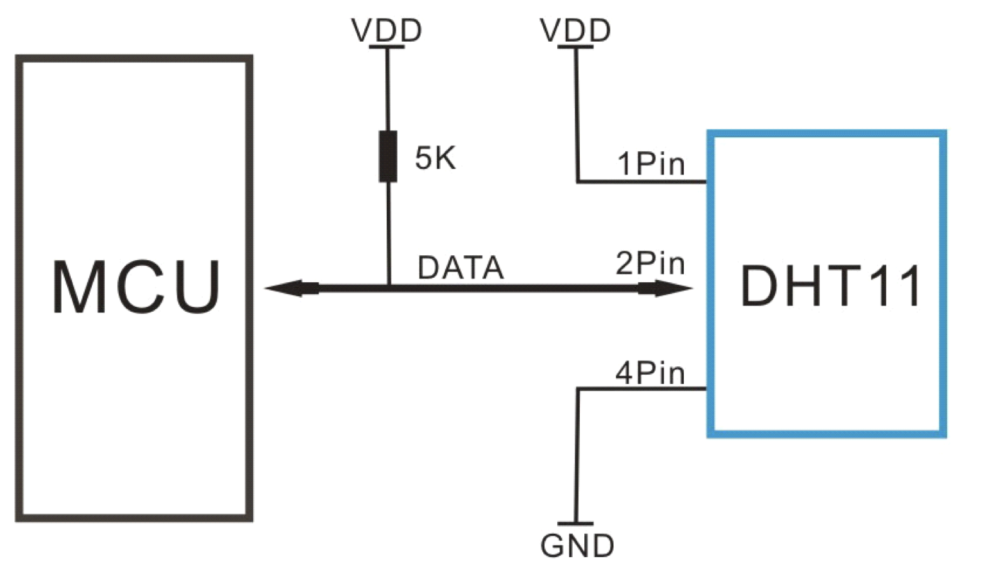
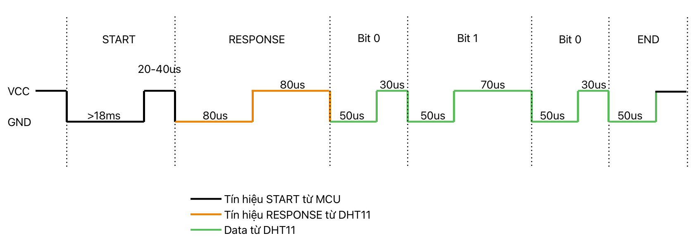
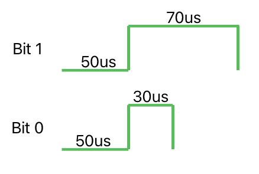
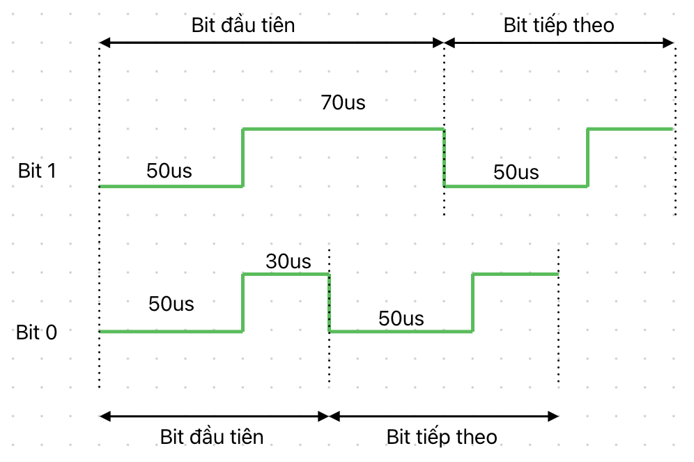
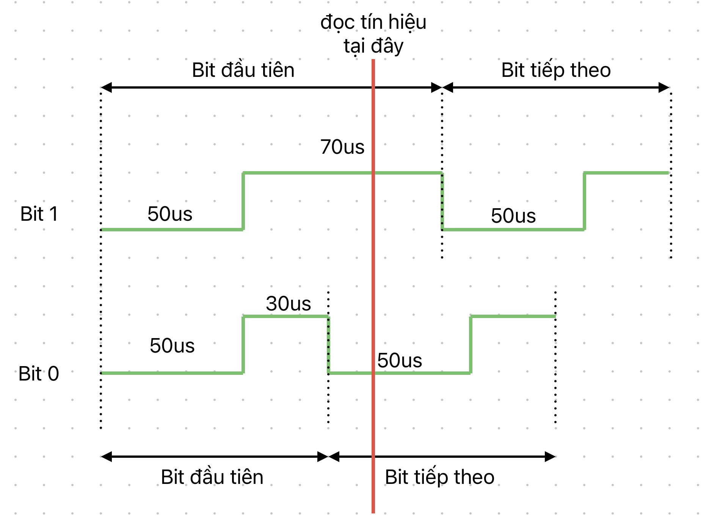
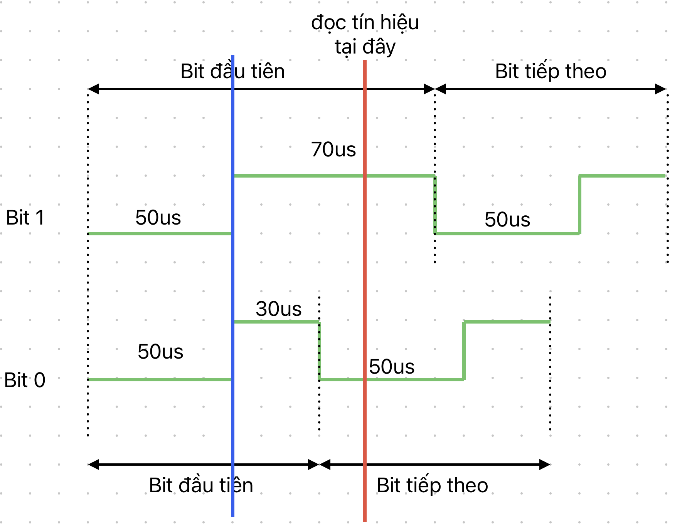

# Giao tiếp DHT11

DHT11 là một module đo nhiệt độ, độ ẩm. Thiết bị này đặc biệt ở chỗ: không sử dụng giao thức truyền thông phổ biến (I2C, UART, SPI); sử dụng một dây duy nhất để truyền/nhận dữ liệu. Bài viết này hướng dẫn sử dụng GPIO trên vi điều khiển STM32F103 để giao tiếp với DHT11

## Mục lục

- [Giao tiếp DHT11](#giao-tiếp-dht11)
  - [Mục lục](#mục-lục)
  - [Kiến thức cần có](#kiến-thức-cần-có)
  - [Mục tiêu bài học](#mục-tiêu-bài-học)
  - [DHT11](#dht11)
  - [Sơ đồ mạch kết nối tới vi điều khiển](#sơ-đồ-mạch-kết-nối-tới-vi-điều-khiển)
  - [Quá trình giao tiếp với DHT11](#quá-trình-giao-tiếp-với-dht11)
    - [Bước 1: MCU gửi START](#bước-1-mcu-gửi-start)
    - [Bước 2: MCU chờ phản hồi từ DHT11](#bước-2-mcu-chờ-phản-hồi-từ-dht11)
    - [Bước 3: MCU đọc 40 bit dữ liệu từ DHT11](#bước-3-mcu-đọc-40-bit-dữ-liệu-từ-dht11)
    - [Bước 4: MCU kiểm tra checksum](#bước-4-mcu-kiểm-tra-checksum)
  - [Project: Đọc nhiệt độ độ ẩm với DHT11](#project-đọc-nhiệt-độ-độ-ẩm-với-dht11)
  - [Câu hỏi](#câu-hỏi)

## Kiến thức cần có

- Series cơ bản

## Mục tiêu bài học

- Hiểu được cách giao tiếp với DHT11
- Tự viết hàm giao tiếp với DHT11
  
## DHT11

DHT11 là một module đo nhiệt độ, độ ẩm. Gồm 4 chân
  
- VCC: Cấp nguồn từ 3 - 5.5V
- GND
- DATA: Chân truyền nhận dữ liệu
- NC: không kết nối

DHT11 giao tiếp sử dụng giao tiếp 1 dây. Dữ liệu truyền và nhận đều qua chân DATA.

## Sơ đồ mạch kết nối tới vi điều khiển



## Quá trình giao tiếp với DHT11

Toàn bộ dữ liệu đều được truyền nhận qua chân DATA. Một khung truyền gồm 40bit (5 bytes) dữ liệu, bit trọng số cao được gửi trước (MSB First).

Khung truyền gồm: 
- 1 byte phần nguyên của độ ẩm (0 - 100%)
- 1 byte phần thập phân của độ ẩm
- 1 byte phần nguyên của nhiệt độ (0 - 50C)
- 1 byte phần thập phân của nhiệt độ
- 1 byte checksum của 4 byte trên

> Lưu ý: Vì DHT11 có độ chính xác là +-1% với độ ẩm, +-1C với nhiệt độ, nên byte phần thập phân luôn đọc là 0.

Khi muốn đọc dữ liệu từ DHT11, MCU gửi đi tín hiệu START. Sau khi nhận được, DHT11 sẽ phản hồi lại tín hiệu RESPONSE, sau đó là phản hồi 40 bit dữ liệu.



Tín hiệu thể hiện số 0 và 1 ở hình dưới.



Quá trình giao tiếp với DHT11 gồm 4 bước:

- Bước 1: MCU gửi START
- Bước 2: MCU chờ phản hồi từ DHT11
- Bước 3: MCU đọc 40 bit dữ liệu từ DHT11
- Bước 4: MCU kiểm tra checksum

### Bước 1: MCU gửi START

Tín hiệu START gồm: ít nhất 18ms mức thấp + 20-40us mức cao, gửi từ MCU.

MCU gửi tín hiệu START dùng GPIO kết hợp delay. Hàm `HAL_Delay(20)` delay 20ms. Hàm này có sẵn trong thư viện HAL. Hàm `delayUs(40)` delay 40us. Hàm này không có sẵn mà phải dùng Timer để tạo khoảng delay chính xác.

```c++
/* 1. MCU send START signal. LOW for >=18ms then HIGH for 20us - 40us */
HAL_GPIO_WritePin(dhtPort, dhtPin, 0);
HAL_Delay(20);
HAL_GPIO_WritePin(dhtPort, dhtPin, 1);
delayUs(40);
```

### Bước 2: MCU chờ phản hồi từ DHT11

Tín hiệu RESPONSE gồm: 80us mức thấp + 80us mức cao, gửi từ DHT11.

Macro `CHECK_PIN_STATE(x)` dùng để đọc mức tín hiệu, kiểm tra xem nó có phải ở mức `x` không. Nếu sai thì trả về 1, coi như lỗi đã xảy ra:

```c++
#define CHECK_PIN_STATE(level)                          \
	{                                                   \
		if (HAL_GPIO_ReadPin(dhtPort, dhtPin) != level) \
			return 1;                                   \
	}
```

Macro `WAIT_FOR_PIN_STATE(x)` dùng để dừng MCU cho tới khi tín hiệu ở mức `x`. Kết hợp với timeout để tránh trường hợp MCU dừng quá lâu. Timeout là 2ms.

```c++
#define WAIT_FOR_PIN_STATE(level)                          \
	{                                                      \
		uint32_t timeout = HAL_GetTick() + 2;              \
		while (HAL_GPIO_ReadPin(dhtPort, dhtPin) != level) \
		{                                                  \
			if (HAL_GetTick() > timeout)                   \
			{                                              \
				return 1; /* Timeout error */              \
			}                                              \
		}                                                  \
	}

```

Code để kiểm tra tín hiệu RESPONSE:

```c++
/* 2. DHT Response. LOW for 80us and HIGH for 80us */
delayUs(20);
CHECK_PIN_STATE(0);
delayUs(80);
CHECK_PIN_STATE(1);
WAIT_FOR_PIN_STATE(0);
```

- Đầu tiên, đợi 20us để đảm bảo đọc tín hiệu vào đúng thời điểm tín hiệu đang ổn định.
- Kiểm tra nếu tín hiệu ở mức thấp
- Đợi 80us.
- Kiểm tra nếu tín hiệu ở mức cao
- Đợi cho tới khi tín hiệu xuống mức thấp (tín hiệu RESPONSE kết thúc)

### Bước 3: MCU đọc 40 bit dữ liệu từ DHT11

Tín hiệu 0 và 1 thể hiện ở thời gian các mức điện áp cao thấp:

- Tín hiệu 0: 50us mức thấp + 30us mức cao
- Tín hiệu 1: 50us mức thấp + 70us mức cao

Do tín hiệu 0 và 1 có độ dài khác nhau (tín hiệu 0 kéo dài 80us, tín hiệu 1 kéo dài 120us) nên thời gian đọc dữ liệu sẽ không cố định mà thay đổi dựa trên dữ liệu.



Vậy làm sao để phân biệt được tín hiệu 0 và 1 ?

Quan sát hình dưới, ta thấy nếu đọc tín hiệu vào thời điểm màu đỏ, ta có thể phân biệt được tín hiệu 0 và tín hiệu 1. Nếu giá trị đọc được là mức thấp thì tín hiệu là 0, nếu là mức cao thì tín hiệu là 1.



Ta có thể lấy thời điểm chuyển từ mức thấp sang cao làm mốc (đường màu xanh hình dưới) để làm mốc đo thời gian. Sau đó dùng hàm `delayUs(40)` để delay tới thời điểm đọc tín hiệu (khoảng 40us).



Code:

```c++
/* 3. Read DHT data */
uint8_t dhtData[5];
for (uint8_t j = 0; j < 5; j++)
	for (uint8_t i = 0; i < 8; i++)
	{
		WAIT_FOR_PIN_STATE(1);
		delayUs(40);
		uint8_t sample = HAL_GPIO_ReadPin(dhtPort, dhtPin);
		dhtData[j] = (dhtData[j] << 1) | sample;
		if (sample == 1)
			WAIT_FOR_PIN_STATE(0);
	}
```

- 2 vòng lặp `for` tương ứng với 8 bit trong một byte, 5 byte tất cả.
- `WAIT_FOR_PIN_STATE(1)` dùng để chờ tới thời điểm chuyển từ mức thấp sang mức cao (đường màu xanh)
- `delayUs(40)`: đợi 40us tới thời điểm đọc
- `uint8_t sample = HAL_GPIO_ReadPin(dhtPort, dhtPin);` Đọc dữ liệu, lưu vào biến `sample`.
- Dịch bit đọc được vào byte.
- Nếu bit đọc được là `1`, cần phải đợi trước khi bắt đầu bit kế tiếp. Dùng `WAIT_FOR_PIN_STATE(0);`

### Bước 4: MCU kiểm tra checksum

Checksum dùng để kiểm tra lỗi của dữ liệu. Checksum được tính bằng cách lấy tổng XOR của 4 byte đầu.

Code:

```c++
/* 4. Checksum */
uint8_t checksum = 0;
for (uint8_t i = 0; i < 4; i++)
{
	checksum ^= dhtData[i];
	if (checksum != dhtData[4])
		return 1;
}
```

## Project: Đọc nhiệt độ độ ẩm với DHT11

Cấu hình STM32F103 như sau:

- Đặt `PB5` thành `GPIO_Output`
- Vào System Core -> GPIO. Chọn `PB5`. 
  - `GPIO output level` = `High`
  - `GPIO mode` = `Output Open Drain`
  - `Maximum output speed` = `High`
- Bật Timer bất kỳ và tự viết hàm `delayUs()` sử dụng ngắt của Timer đó.
- Bật UART để đọc dữ liệu lên máy tính
- Sử dụng clock thạch anh ngoài.

Trong file `main.c`:
- Viết hàm `delayUs()`.
- Khai báo biến cấu trúc đại diện cho DHT11, khởi tạo giá trị `pin`, `port` với hàm `initDHT11()`.
- Gọi hàm `readDHT11()`.
- Đọc nhiệt độ độ ẩm từ biến cấu trúc, rồi in lên Serial

## Câu hỏi

1. Một khung truyền tới DHT11 gồm bao nhiêu bit? Ý nghĩa của các bit ấy là gì?
2. Mô tả tín hiệu START và RESPONSE?
3. Tín hiệu điện thế nào thì được hiểu là tín hiệu 0? tín hiệu 1?
4. Đọc chân tín hiệu như thế nào để phân biệt được tín hiệu 0 và tín hiệu 1?
5. Giải thích các macro `CHECK_PIN_STATE(x)` và `WAIT_FOR_PIN_STATE(x)`. Dùng chúng khi nào ?
6. Tính checksum thế nào?