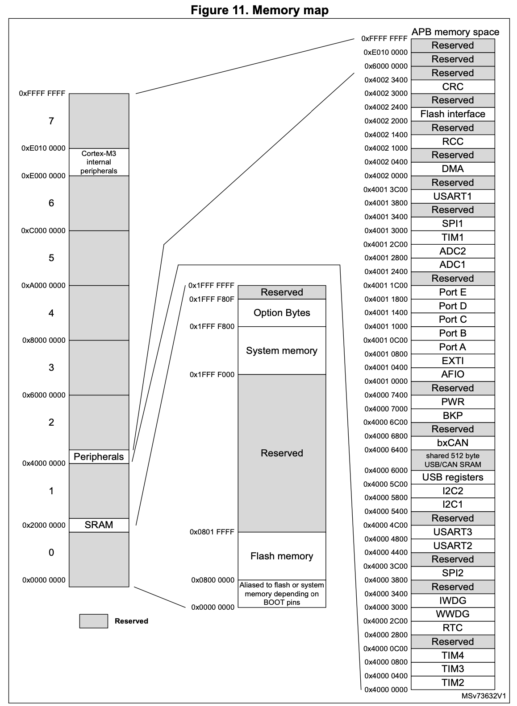

# Memory Mapping trong STM32F103

- [Memory Mapping trong STM32F103](#memory-mapping-trong-stm32f103)
	- [Giới thiệu](#giới-thiệu)
	- [Không gian địa chỉ của STM32F103C8](#không-gian-địa-chỉ-của-stm32f103c8)
	- [Tài liệu tham khảo](#tài-liệu-tham-khảo)

## Giới thiệu

Mỗi ô nhớ (1 byte) trong vi điều khiển đều có địa chỉ riêng của nó. Một địa chỉ có 32 bit biểu diễn, giá trị từ `0x00000000` tới `0xFFFFFFFF`, tạo thành 4GiB không gian địa chỉ. Các ngoại vi (SPI1, I2C1,...), các bus (AHB, APB1, APB2,...) và bộ nhớ (nội, ngoại) được ánh xạ tới một vùng địa chỉ trong không gian địa chỉ. Với địa chỉ đã biết, ta có thể dùng các kỹ thuật lập trình để truy cập tới ngoại vi, bus, hay bộ nhớ đó (ví dụ - dùng con trỏ trong C).

## Không gian địa chỉ của STM32F103C8

*Nguồn: Datasheet STM32F103C8 - phần 4. Memory Mapping*

Trên không gian địa chỉ của STM32F103C8 gồm các phần:

- `0x00000000` - `0x1FFFFFFF`: Phần này ánh xạ tới bộ nhớ Flash, bộ nhớ hệ thống và các option byte
  
  - `0x00000000` - `0x08000000`: Đây là vùng ánh xạ lại - có thể ánh xạ tới 3 vị trí khác nhau: FLASH (0x08000000), SRAM (0x20000000) hoặc bọ nhớ hệ thống (0x1FFFF000). Khi khởi động hoặc reset, vi điều khiển sẽ tìm tới `ResetHandler` ở địa chỉ 0x00000004. Thay đổi vị trí ánh xạ khiến vi điều khiển thực thi chương trình ở những nơi khác nhau: FLASH, SRAM, bộ nhớ hệ thống,tuỳ vào cấu hình BOOT. Cấu hình BOOT tham khảo ở `AN2606`.
  - `0x08000000` - `0x0801FFFF`: Vùng nhớ FLASH. Chương trình của người dùng được lưu trong bộ nhớ này. Vùng này là chỉ đọc. Mọi hoạt động ghi vào vùng nhớ này (nếu chưa mở khoá FLASH) đều gây ra `HardFault`.
  - `0x1FFFF000` - `0x1FFFF800`: Vùng nhớ hệ thống. Vùng này chưa bootloader cho ST cài đặt sẵn. Bootloader này giúp nạp code của người dùng và ghi vào FLASH với các giao tiếp UART, I2C, SPI, CAN,... Vùng nhớ này chỉ đọc.  Mọi hoạt động ghi vào vùng nhớ này đều gây ra `HardFault`.
  - `0x1FFFF800` - `0x1FFFF80F`: Vùng option bytes. Đây là vùng chứa các cài đặt ảnh hưởng lớn tới vi điều khiển. Một số cài đặt gồm:
	
	- Cấu hình boot mặc định: Kết hợp với BOOT0 và BOOT1 để quyết định cấu hình BOOT.
	- Bảo vệ đọc (Read-out protection): Chế độ bảo vệ khiến bên ngoài không thể truy cập tới vùng FLASH.
- `0x20000000` + 0.5GiB: Vùng SRAM. Đây là vùng RAM nội bên trong vi điều khiển. Kích thước vùng này phụ thuộc vào vi điều khiển
- `0x4000000` + 0.5GiB: Vùng ngoại vi của vi điều khiển STM32. Vùng này lại được chia thành 3 vùng nhỏ tương ứng với 3 đường bus: AHB, APB1, APB2. Mỗi bus gồm các ngoại vi thuộc bus đó. Tham khảo thêm tại `RM0008` - phần 3.3 Memory map
- `0xE0000000` - `0xE0100000`: Vùng chứa ngoại vi bên trong lõi Cortex-M3. Ánh xạ tới các ngoại vi NVIC, SysTick,...

## Tài liệu tham khảo

[1] STMicroelectronics, "Medium-density performance line Arm®-based 32-bit MCU with 64 or 128 KB Flash, USB, CAN, 7 timers, 2 ADCs, 9 com. interfaces", STM32F103Cx8/B Datasheet, Sep. 2023.

[2] STMicroelectronics, "STM32F101xx, STM32F102xx, STM32F103xx,STM32F105xx and STM32F107xx advanced Arm®-based 32-bit MCUs", RM0008 Reference manual, Rev 21, Feb. 2021.