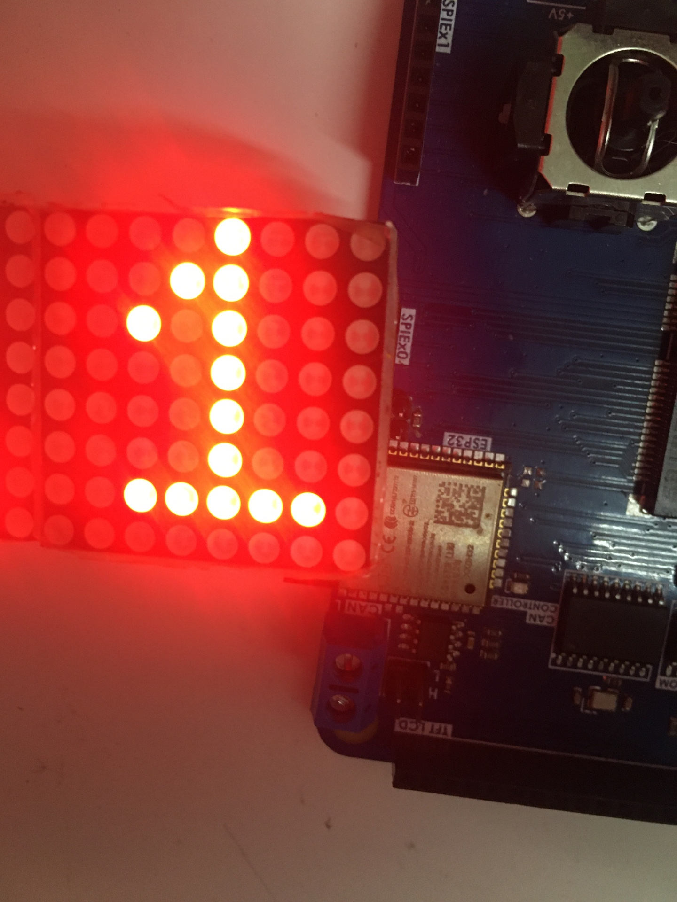

# Bài 3.1: Điều khiển LED ma trận dùng IC MAX7219

## Mục lục

- [Bài 3.1: Điều khiển LED ma trận dùng IC MAX7219](#bài-31-điều-khiển-led-ma-trận-dùng-ic-max7219)
	- [Mục lục](#mục-lục)
	- [LED ma trận 8x8](#led-ma-trận-8x8)
	- [Multiplexing](#multiplexing)
	- [Charlieplexing](#charlieplexing)
	- [Project: Hiển thị hình lên LED ma trận 8x8 dùng IC MAX7219](#project-hiển-thị-hình-lên-led-ma-trận-8x8-dùng-ic-max7219)
		- [Tạo project mới, cấu hình SPI và GPIO](#tạo-project-mới-cấu-hình-spi-và-gpio)
		- [Thêm thư viện](#thêm-thư-viện)
		- [Các hàm sử dụng](#các-hàm-sử-dụng)
	- [Code](#code)
		- [Kết quả](#kết-quả)
	- [Câu hỏi và bài tập](#câu-hỏi-và-bài-tập)
	- [Bài tập](#bài-tập)
	- [Tài liệu tham khảo](#tài-liệu-tham-khảo)


## LED ma trận 8x8

**LED ma trận 8x8** là một màn hình LED được sắp xếp thành một lưới gồm 8 hàng và 8 cột, tổng cộng có 64 đèn LED nhỏ. Những LED này có thể được điều khiển để hiển thị các hình ảnh, ký tự, hoặc hiệu ứng khác nhau bằng cách bật và tắt các điểm ảnh (pixel) trong ma trận


Để điều khiển LED ma trận, ta cần phải hiểu cấu tạo và nguyên lý hoạt động của nó. Sơ đồ mạch điện bên trong LED ma trận như sau:


LED ma trận gồm 8 chân điều khiển hàng và 8 chân điều khiển cột. Các chân hàng sẽ nối với cực Anode của LED (cực "dương"), các chân cột sẽ nối với Cathode của LED (cực "âm").

Khi muốn bật 1 LED tại vị trí cụ thể, chẳng hạn cột 3 hàng 5, ta sẽ nối chân cột 3 với GND, chân hàng 5 với nguồn.


Vậy nếu ta muốn điều khiển 2 đèn LED sáng thì sao? Giả sử ta muốn cho đèn tại cột 6, hàng 7 sáng. Ta nối cột 6 với GND, hàng 7 với nguồn.


Tuy nhiên, thực tế, không chỉ có 2 đèn sáng mà tới 4 đèn sáng. Các đèn ở cột 6, hàng 5 và cột 3 hàng 7 cũng sáng, do các đèn sử dụng chung đường dây hàng và cột.


Do đó, không thể chỉ đơn thuần bật/tắt dây hàng/cột để điều khiển LED ma trận. Muốn điều khiển 64 LED từng con một, cần tới 64 chân điều khiển! (trên LED ma trận chỉ có 16 chân). Người ta phải sử dụng một số kỹ thuật để điều khiển, như Multiplexing và Charlieplexing.

## Multiplexing

Quay lại với câu chuyện điều khiển 2 LED sáng trên LED ma trận. Lần này ta muốn điều khiển LED ở hàng 1, cột 3 và LED ở hàng 1, cột 8 sáng. Ta nối dây hàng 1 với nguồn, cột 3 và cột 8 với GND:


Chỉ có 2 đèn sáng (thay vì 4 như trường hợp ban đầu), vì chúng **cùng nằm trên một hàng**. Hơn nữa ta có thể điều khiển ***bất kỳ*** đèn LED nào sáng hay không sáng, miễn là chúng ***nằm cùng một hàng*** (hoặc cùng một cột). Giả sử điều khiển LED cột 2, 3, 5, 7, 8 sáng, cột 1, 4, 6 tắt, ta nối hàng 1 với nguồn, cột 2, 3, 5, 7, 8 với GND:


Cách này dẫn tới ý tưởng: Ta chỉ điều khiển 1 hàng duy nhất tại một thời điểm. Sau một khoảng thời gian, ta chuyển sang điều khiển hàng tiếp theo. Sau một khoảng thời gian, lại điều khiển hàng tiếp theo đó nữa. Lặp đi lặp lại như thế ở tần số cao, đủ để mắt người không theo kịp, khi đó ta sẽ điều khiển được bất kỳ LED nào trên ma trận.

Ví dụ: Ta muốn hiển thị hình này lên ma trận:


Tại thời điểm ban đầu, ta sẽ điều khiển cho hàng số 1 sáng:


Sau khoảng thời gian T, ta tắt hàng 1 đi và điều khiển hàng 2:


Sau khoảng thời gian T, ta tắt hàng 2 đi và điều khiển hàng 3:


Làm tương tự, tới hàng 8 thì quay về hàng 1. Lặp lại ở tần số cao, mắt người sẽ không theo kịp và nhìn thấy hình ảnh.

Đây chính là kỹ thuật LED Multiplexing (đa hợp LED). Để điều khiển ma trận LED `m x n` cần sử dụng `m + n` chân để điều khiển; ít hơn nhiều so với điều khiển từng LED một (cần `m x n` chân)

Kỹ thuật này được tích hợp trong IC MAX7219 để điều khiển ma trận LED 8x8.

## Charlieplexing

Đây là kỹ thuật điều khiển LED với số chân rất ít. Kỹ thuật này chỉ có thể sử dụng khi ngõ ra của vi điều khiển là 3 trạng thái (tri-state): ngõ ra mức cao, ngõ ra mức thấp và ngõ vào (trở kháng cao). Điều khiển ma trận 8x8 với Charlieplexing chỉ cần sử dụng 9 chân (16 chân đối với Multiplexing, 64 chân đối với điều khiển từng con một). Tham khảo kỹ thuật này ở [Wikipedia](https://en-m-wikipedia-org.translate.goog/wiki/Charlieplexing?_x_tr_sl=en&_x_tr_tl=vi&_x_tr_hl=vi&_x_tr_pto=tc)

## Project: Hiển thị hình lên LED ma trận 8x8 dùng IC MAX7219

### Tạo project mới, cấu hình SPI và GPIO

Thực hiện tương tự bài trước.

### Thêm thư viện

Thực hiện tương tự bài trước.

### Các hàm sử dụng

```c++
/* Khởi tạo MAX7219 chế độ điều khiển ma trận LED */
void MAX7219_InitMatrix(MAX7219 *dev, SPI_HandleTypeDef *hspi, GPIO_TypeDef *csPinPort, uint16_t csPin);

/* 
* In hình lên ma trận 8x8
* buffer: con trỏ tới hình
*/
void MAX7219_PrintMatrix(MAX7219 *dev, uint8_t* buffer);
```

Để sử dụng hàm `void MAX7219_PrintMatrix(MAX7219 *dev, uint8_t* buffer)`, ta phải hiểu cách một tấm hình được lưu trữ. Trên ma trận LED 8x8, ta coi LED sáng = 1, LED tắt = 0. Mỗi hàng LED gồm 8 đèn, được biểu diễn bằng 8 bit (1 byte). Có 8 hàng, như vậy cần 8 byte để lưu trữ một hình. 8 byte này đặt trong một mảng `buffer`.

Ví dụ: hình ảnh của số "1":

```c++
uint8_t number1[8] = {
		0b00001000, // Row 1
		0b00011000, // Row 2
		0b00101000, // Row 3
		0b00001000, // Row 4
		0b00001000, // Row 5
		0b00001000, // Row 6
		0b00111110, // Row 7
		0b00000000  // Row 8
		};
```

## Code

Code trong `main.c`:

```c++
/* USER CODE BEGIN Header */
/**
 ******************************************************************************
 * @file           : main.c
 * @brief          : Main program body
 ******************************************************************************
 * @attention
 *
 * Copyright (c) 2024 STMicroelectronics.
 * All rights reserved.
 *
 * This software is licensed under terms that can be found in the LICENSE file
 * in the root directory of this software component.
 * If no LICENSE file comes with this software, it is provided AS-IS.
 *
 ******************************************************************************
 */
/* USER CODE END Header */
/* Includes ------------------------------------------------------------------*/
#include "main.h"

/* Private includes ----------------------------------------------------------*/
/* USER CODE BEGIN Includes */
/* Thêm thư viện */
#include "max7219.h"

/* USER CODE END Includes */

/* Private typedef -----------------------------------------------------------*/
/* USER CODE BEGIN PTD */

/* USER CODE END PTD */

/* Private define ------------------------------------------------------------*/
/* USER CODE BEGIN PD */

/* USER CODE END PD */

/* Private macro -------------------------------------------------------------*/
/* USER CODE BEGIN PM */

/* USER CODE END PM */

/* Private variables ---------------------------------------------------------*/
SPI_HandleTypeDef hspi2;

/* USER CODE BEGIN PV */
/* Khai báo biến max7219 */
MAX7219 max7219;

/* USER CODE END PV */

/* Private function prototypes -----------------------------------------------*/
void SystemClock_Config(void);
static void MX_GPIO_Init(void);
static void MX_SPI2_Init(void);
/* USER CODE BEGIN PFP */

/* USER CODE END PFP */

/* Private user code ---------------------------------------------------------*/
/* USER CODE BEGIN 0 */

/* USER CODE END 0 */

/**
 * @brief  The application entry point.
 * @retval int
 */
int main(void) {
	/* USER CODE BEGIN 1 */

	/* USER CODE END 1 */

	/* MCU Configuration--------------------------------------------------------*/

	/* Reset of all peripherals, Initializes the Flash interface and the Systick. */
	HAL_Init();

	/* USER CODE BEGIN Init */

	/* USER CODE END Init */

	/* Configure the system clock */
	SystemClock_Config();

	/* USER CODE BEGIN SysInit */

	/* USER CODE END SysInit */

	/* Initialize all configured peripherals */
	MX_GPIO_Init();
	MX_SPI2_Init();
	/* USER CODE BEGIN 2 */

	/* Khởi tạo max7219 sử dụng SPI2 và PB1 làm chân CS, chế độ điều khiển ma trận led */
	MAX7219_InitMatrix(&max7219, &hspi2, GPIOB, GPIO_PIN_1);

	/* Đặt độ sáng vừa phải */
	MAX7219_ChangeIntensity(&max7219, 0x08);

	uint8_t number1[8] = {
			0b00001000, // Row 1
			0b00011000, // Row 2
			0b00101000, // Row 3
			0b00001000, // Row 4
			0b00001000, // Row 5
			0b00001000, // Row 6
			0b00111110, // Row 7
			0b00000000  // Row 8
			};

	MAX7219_PrintMatrix(&max7219, number1);
	HAL_Delay(500);

	/* USER CODE END 2 */

	/* Infinite loop */
	/* USER CODE BEGIN WHILE */
	while (1) {
		/* USER CODE END WHILE */

		/* USER CODE BEGIN 3 */

	}
	/* USER CODE END 3 */
}

/**
 * @brief System Clock Configuration
 * @retval None
 */
void SystemClock_Config(void) {
	RCC_OscInitTypeDef RCC_OscInitStruct = { 0 };
	RCC_ClkInitTypeDef RCC_ClkInitStruct = { 0 };

	/** Initializes the RCC Oscillators according to the specified parameters
	 * in the RCC_OscInitTypeDef structure.
	 */
	RCC_OscInitStruct.OscillatorType = RCC_OSCILLATORTYPE_HSI;
	RCC_OscInitStruct.HSIState = RCC_HSI_ON;
	RCC_OscInitStruct.HSICalibrationValue = RCC_HSICALIBRATION_DEFAULT;
	RCC_OscInitStruct.PLL.PLLState = RCC_PLL_NONE;
	if (HAL_RCC_OscConfig(&RCC_OscInitStruct) != HAL_OK) {
		Error_Handler();
	}

	/** Initializes the CPU, AHB and APB buses clocks
	 */
	RCC_ClkInitStruct.ClockType = RCC_CLOCKTYPE_HCLK | RCC_CLOCKTYPE_SYSCLK
			| RCC_CLOCKTYPE_PCLK1 | RCC_CLOCKTYPE_PCLK2;
	RCC_ClkInitStruct.SYSCLKSource = RCC_SYSCLKSOURCE_HSI;
	RCC_ClkInitStruct.AHBCLKDivider = RCC_SYSCLK_DIV1;
	RCC_ClkInitStruct.APB1CLKDivider = RCC_HCLK_DIV1;
	RCC_ClkInitStruct.APB2CLKDivider = RCC_HCLK_DIV1;

	if (HAL_RCC_ClockConfig(&RCC_ClkInitStruct, FLASH_LATENCY_0) != HAL_OK) {
		Error_Handler();
	}
}

/**
 * @brief SPI2 Initialization Function
 * @param None
 * @retval None
 */
static void MX_SPI2_Init(void) {

	/* USER CODE BEGIN SPI2_Init 0 */

	/* USER CODE END SPI2_Init 0 */

	/* USER CODE BEGIN SPI2_Init 1 */

	/* USER CODE END SPI2_Init 1 */
	/* SPI2 parameter configuration*/
	hspi2.Instance = SPI2;
	hspi2.Init.Mode = SPI_MODE_MASTER;
	hspi2.Init.Direction = SPI_DIRECTION_1LINE;
	hspi2.Init.DataSize = SPI_DATASIZE_8BIT;
	hspi2.Init.CLKPolarity = SPI_POLARITY_LOW;
	hspi2.Init.CLKPhase = SPI_PHASE_1EDGE;
	hspi2.Init.NSS = SPI_NSS_SOFT;
	hspi2.Init.BaudRatePrescaler = SPI_BAUDRATEPRESCALER_2;
	hspi2.Init.FirstBit = SPI_FIRSTBIT_MSB;
	hspi2.Init.TIMode = SPI_TIMODE_DISABLE;
	hspi2.Init.CRCCalculation = SPI_CRCCALCULATION_DISABLE;
	hspi2.Init.CRCPolynomial = 10;
	if (HAL_SPI_Init(&hspi2) != HAL_OK) {
		Error_Handler();
	}
	/* USER CODE BEGIN SPI2_Init 2 */

	/* USER CODE END SPI2_Init 2 */
}

/**
 * @brief GPIO Initialization Function
 * @param None
 * @retval None
 */
static void MX_GPIO_Init(void) {
	GPIO_InitTypeDef GPIO_InitStruct = { 0 };
	/* USER CODE BEGIN MX_GPIO_Init_1 */
	/* USER CODE END MX_GPIO_Init_1 */

	/* GPIO Ports Clock Enable */
	__HAL_RCC_GPIOB_CLK_ENABLE();

	/*Configure GPIO pin Output Level */
	HAL_GPIO_WritePin(GPIOB, GPIO_PIN_1, GPIO_PIN_SET);

	/*Configure GPIO pin : PB1 */
	GPIO_InitStruct.Pin = GPIO_PIN_1;
	GPIO_InitStruct.Mode = GPIO_MODE_OUTPUT_PP;
	GPIO_InitStruct.Pull = GPIO_NOPULL;
	GPIO_InitStruct.Speed = GPIO_SPEED_FREQ_LOW;
	HAL_GPIO_Init(GPIOB, &GPIO_InitStruct);

	/* USER CODE BEGIN MX_GPIO_Init_2 */
	/* USER CODE END MX_GPIO_Init_2 */
}

/* USER CODE BEGIN 4 */

/* USER CODE END 4 */

/**
 * @brief  This function is executed in case of error occurrence.
 * @retval None
 */
void Error_Handler(void) {
	/* USER CODE BEGIN Error_Handler_Debug */
	/* User can add his own implementation to report the HAL error return state */
	__disable_irq();
	while (1) {
	}
	/* USER CODE END Error_Handler_Debug */
}

#ifdef USE_FULL_ASSERT
/**
 * @brief  Reports the name of the source file and the source line number
 *         where the assert_param error has occurred.
 * @param  file: pointer to the source file name
 * @param  line: assert_param error line source number
 * @retval None
 */
void assert_failed(uint8_t *file, uint32_t line)
{
	/* USER CODE BEGIN 6 */
	/* User can add his own implementation to report the file name and line number,
	   ex: printf("Wrong parameters value: file %s on line %d\r\n", file, line) */
	/* USER CODE END 6 */
}
#endif /* USE_FULL_ASSERT */

```

Giải thích:

Thêm thư viện:
```c++
...
/* Private includes ----------------------------------------------------------*/
/* USER CODE BEGIN Includes */
/* Thêm thư viện */
#include "max7219.h"

/* USER CODE END Includes */
...
```

Khai báo biến:
```c++
...
/* USER CODE BEGIN PV */
/* Khai báo biến max7219 */
MAX7219 max7219;

/* USER CODE END PV */
...
```

Trong hàm `main()`:

```c++
...
/* USER CODE BEGIN 2 */

/* Khởi tạo max7219 sử dụng SPI2 và PB1 làm chân CS, chế độ điều khiển ma trận led */
MAX7219_InitMatrix(&max7219, &hspi2, GPIOB, GPIO_PIN_1);

/* Đặt độ sáng vừa phải */
MAX7219_ChangeIntensity(&max7219, 0x08);

/* Ảnh của số "1" */
uint8_t number1[8] = {
		0b00001000, // Row 1
		0b00011000, // Row 2
		0b00101000, // Row 3
		0b00001000, // Row 4
		0b00001000, // Row 5
		0b00001000, // Row 6
		0b00111110, // Row 7
		0b00000000  // Row 8
		};

/* In lên ma trận */
MAX7219_PrintMatrix(&max7219, number1);

/* Delay chả để làm gì */
HAL_Delay(500);

/* USER CODE END 2 */
...
```

### Kết quả



## Câu hỏi và bài tập

1. Khi điều khiển LED ma trận 8x8, vì sao khi ta cố điều khiển cho hai đèn LED sáng (ở khác hàng khác cột), không chỉ hai đèn mà bốn đèn sáng ?
2. Vì sao người ta không dùng 64 chân điều khiển 64 đèn LED?

## Bài tập

1. In số "2" lên ma trận LED
2. In hình động lên ma trận LED. Gợi ý: tạo nhiều mảng, mỗi mảng là một khung hình.
3. In số "1", nhưng di chuyển từ trái sang phải trên ma trận. Gợi ý: thay đổi mảng ban đầu, dùng toán tử dịch bit (<< hoặc >>). Gọi `MAX7219_PrintMatrix(&max7219, number1);` để cập nhật.
4. (Khó) Một mạch gồm 4 mạch IC MAX7219 và ma trận 8x8 mắc nối tiếp nhau. Chúng đặt cạnh nhau thành một ma trận lớn 32x8:


Hiển thị một hình 32x8 lên ma trận lớn này.

Gợi ý: Mỗi hàng có 32 LED thì biểu diễn bằng một số `uint32_t`. Có 8 hàng thì biểu diễn bằng một mảng 8 phần tử `uint32_t`. Dùng hàm `MAX7219_PrintMatrix32()` để in lên ma trận.

## Tài liệu tham khảo

[1] STMicroelectronics, "Medium-density performance line Arm®-based 32-bit MCU with 64 or 128 KB Flash, USB, CAN, 7 timers, 2 ADCs, 9 com. interfaces", STM32F103Cx8/B Datasheet, Sep. 2023.

[2] Maxim Integrated, "Serially Interfaced, 8-Digit LED Display Drivers", MAX7219-MAX7221 Datasheet, Rev August. 2021