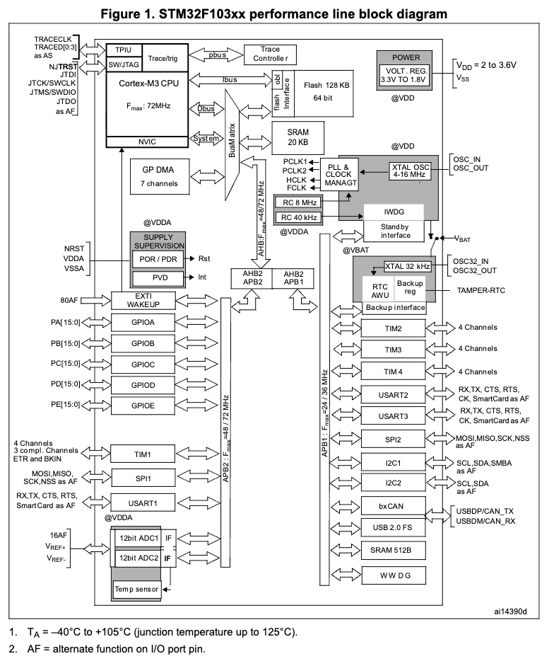
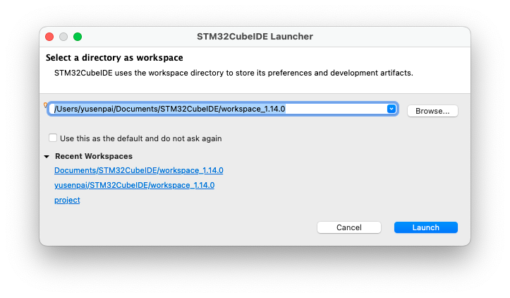
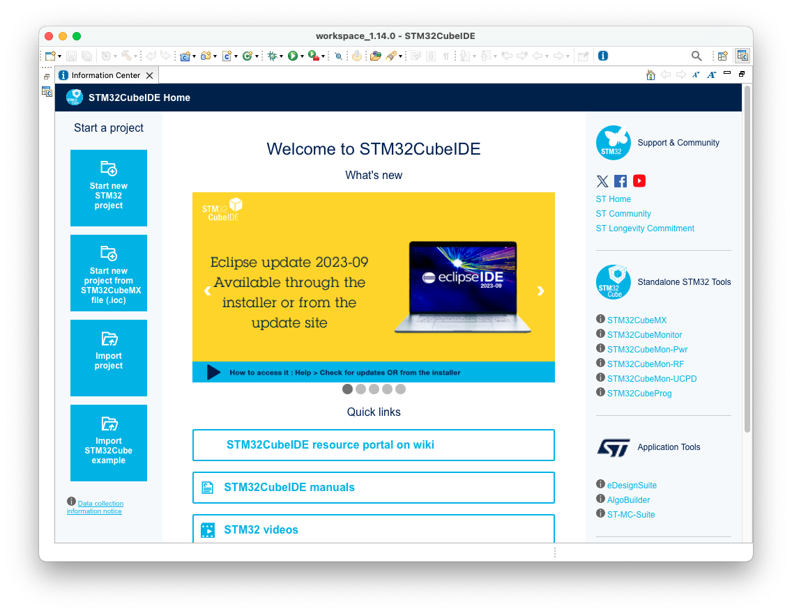
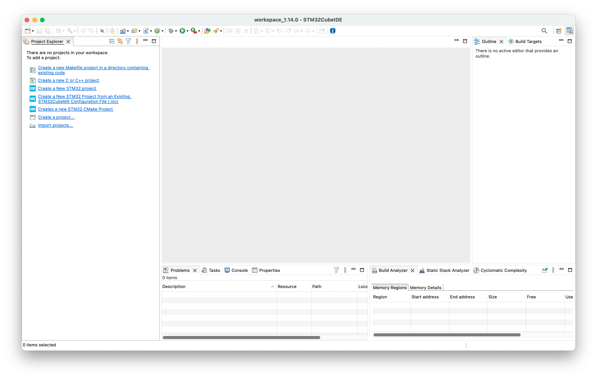
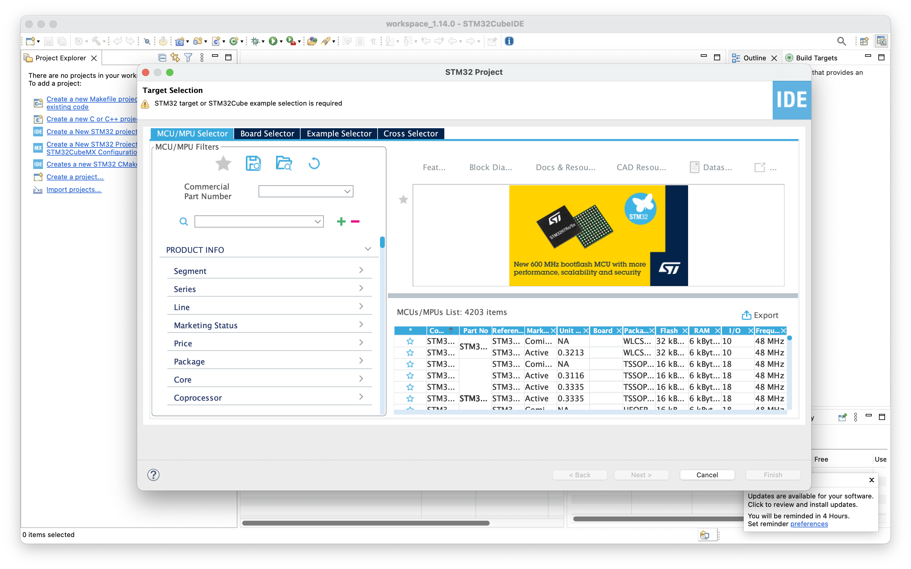
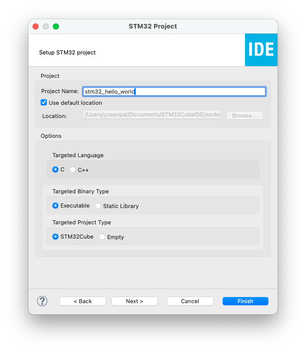
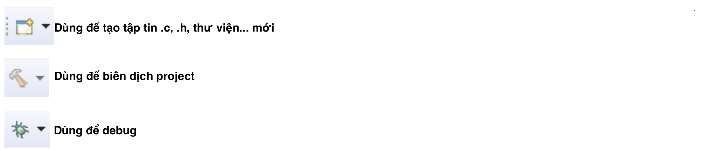

# Bài 1: Giới thiệu về STM32, phần mềm STM32CubeIDE và thư viện HAL

**STM32** là họ vi điều khiển 32-bit được phát triển với STMicroelectronics, dựa trên lõi ARM Cortex-M. Đây là dòng vi điều khiển được sử dụng rất rộng rãi bởi tính năng mạnh mẽ, tiêu thụ năng lượng thấp.

**STM32CubeIDE** là một **môi trường phát triển tích hợp** (IDE) cung cấp bởi STMicroelectronics. Phần mềm tích hợp đầy đủ các tính năng hỗ trợ cho việc phát triển vi điều khiển STM32, gồm:

- Code editor
- Quản lý project
- Trình biên dịch (compiler)
- Trình sửa lỗi (debugger)
- STM32CubeMX: là phần mềm giao diện để đơn giản hóa việc cấu hình vi điều khiển STM32; tự động tạo code khởi tạo cho các ngoại vi.

**Thư viện HAL** (Hardware Abstraction Layer) là thư viện được phát triển bởi STMicroelectronics cho vi điều khiển STM32.

Bài viết này sẽ hướng dẫn những bước cơ bản đầu tiên để lập trình vi điều khiển STM32.

## Mục lục

- [Bài 1: Giới thiệu về STM32, phần mềm STM32CubeIDE và thư viện HAL](#bài-1-giới-thiệu-về-stm32-phần-mềm-stm32cubeide-và-thư-viện-hal)
  - [Mục lục](#mục-lục)
  - [Kiến thức cần có](#kiến-thức-cần-có)
  - [Mục tiêu bài học](#mục-tiêu-bài-học)
  - [Vi điều khiển STM32](#vi-điều-khiển-stm32)
  - [STM32CubeIDE](#stm32cubeide)
    - [Cài đặt phần mềm](#cài-đặt-phần-mềm)
    - [Sử dụng phần mềm](#sử-dụng-phần-mềm)
      - [Infomation Center](#infomation-center)
      - [Perspectives (tạm dịch - Giao diện)](#perspectives-tạm-dịch---giao-diện)
      - [Workspace và project](#workspace-và-project)
      - [Tạo project mới](#tạo-project-mới)
      - [Thông tin về project](#thông-tin-về-project)
      - [Giao diện STM32CubeMX (Device Configuration)](#giao-diện-stm32cubemx-device-configuration)
  - [Thư viện HAL](#thư-viện-hal)
  - [Cấu trúc tên hàm](#cấu-trúc-tên-hàm)
    - [Mô hình lập trình](#mô-hình-lập-trình)
  - [Câu hỏi và bài tập](#câu-hỏi-và-bài-tập)
    - [Câu hỏi](#câu-hỏi)
    - [Bài tập](#bài-tập)
  - [Tài liệu tham khảo](#tài-liệu-tham-khảo)


## Kiến thức cần có

- Ngôn ngữ lập trình C

## Mục tiêu bài học

- Học cách sử dụng phần mềm STM32CubeIDE

## Vi điều khiển STM32

**STM32** là họ vi điều khiển 32-bit được phát triển với STMicroelectronics, dựa trên lõi ARM Cortex-M. Có rất nhiều dòng STM32, bao gồm:

- STM32 hiệu suất cao (high performance):
  - STM32F2
  - STM32F4
  - STM32F7
  - STM32H5
  - STM32H7
- STM32 dòng chủ đạo (mainstream):
  - STM32C0
  - STM32F0
  - STM32F1
  - STM32F3
  - STM32G0
  - STM32G4
- STM32 tiết kiệm điện (ultra low power):
  - STM32L0
  - STM32L0+
  - STM32L4
  - STM32L5
  - STM32U0
  - STM32U5
- STM32 không dây (wireless):
  - STM32WB
  - STM32WB0
  - STM32WBA
  - STM32WL

Series bài học này sẽ sử dụng vi điều khiển STM32F103C8T6. Đây là vi điều khiển thuộc dòng chủ đạo. Các thông số gồm:

- CPU: ARM Cortex-M3, tần số tối đa 72MHz.
- Bộ nhớ
  - 64KB Flash
  - 20KB RAM
- Điện áp cấp, xung clock
  - Hoạt động với 2.0 - 3.6V
  - Dao động thạch anh 4 - 16MHz
  - Dao động RC nội 8MHz
  - Dao động RC nội 40kHz
  - Tích hợp PLL (mạch nhân tần số) cho CPU
  - Dạo động thạch anh 32kHz
- 2x 12-bit, 1us ADC, tối đa 16 kênh
  - Điện áp chuyển đổi: 0 - 3.6V
  - Cảm biến nhiệt độ
- DMA (Direct Memory Access)
  - 7 kênh DMA
  - Ngoại vi hỗ trợ: Timer, ADC, SPI, I2C và USART
- 37 chân GPIO
  - Tất cả đều có ngắt ngoài, ánh xạ trên 16 vector ngắt ngoài.
  - Gần như mọi chân đều chịu được 5V
- Debug
  - Giao tiếp SWD và JTAG
- 7 Timer
  - 3x timer 16-bit, mỗi timer có tới 4 kênh IC/OC/PWM hoặc kênh đếm xung và ngõ vào encoder.
  - 1x timer 16-bit, điều khiển động cơ với PWM, tự động tạo deadtime và dừng khẩn cấp
  - 2x watchdog timer
  - 1x SysTick timer, timer 24-bit đếm xuống
- 9 ngoại vi cho các giao tiếp truyền thông
  - 2x I2C (SMBus/PMBus)
  - 3x USART (ISO 7816, LIN, IrDA, modem)
  - 2x SPI (18Mbit/s)
  - 1x CAN (2.0B)
  - 1x USB 2.0 full-speed
- Khối tính toán CRC



Tham khảo thêm ở datasheet của 
[STM32F103C8T6](stm32f103c8_datasheet.pdf)

## STM32CubeIDE

**STM32CubeIDE** là một **môi trường phát triển tích hợp** (IDE) cung cấp bởi STMicroelectronics, tích hợp đầy đủ các tính năng hỗ trợ cho việc phát triển vi điều khiển STM32.

### Cài đặt phần mềm

Truy cập trang web [my.st.com](https://my.st.com/cas/login?lang=en&service=https%3A%2F%2Fwww.st.com%2Fcontent%2Fst_com%2Fen.html), chọn Create Account để tạo tài khoản cá nhân.


Sau khi nhập các thông tin cần thiết, chọn Register. Có thể yêu cầu kiểm tra email để xác nhận.

Sau khi tạo xong tài khoản, đăng nhập vào tài khoản vừa tạo, rồi truy cập tới https://www.st.com/en/development-tools/stm32cubeide.html#get-software để tải STM32CubeIDE.


Chọn Get latest ứng với hệ điều hành của máy. Tải về rồi tiến hành cài đặt phần mềm.

### Sử dụng phần mềm

Khi khởi động, phần mềm sẽ yêu cầu chọn thư mục làm việc. Có thể thay đổi hoặc để thư mục mặc định. Chọn **Launch**.


#### Infomation Center

Khi STM32CubeIDE chạy lần đầu, cửa sổ *Infomation Center* sẽ mở lên.



Cửa sổ *Infomation Center* cho phép tìm kiếm thông tin về sản phẩm và cách sử dụng chúng. Ta sẽ quay lại phần này sau ở [Help]>[Infomation Center].

#### Perspectives (tạm dịch - Giao diện)

STM32CubeIDE sử dụng *Perspectives* hay *Giao diện*. Giao diện là tập hợp các cửa sổ chức năng sử dụng cho một mục đích.

Có ba giao diện:
- C/C++
- STM32CubeMX (Device Configuration Tool)
- Debug

*Giao diện C/C++* gồm các cửa sổ liên quan tới viết và chỉnh sửa code. Phần lớn thời gian ta dành cho giao diện này. Ảnh dưới chính là *giao diện C/C++*:



#### Workspace và project

Workspace (môi trường làm việc) chứa các thư mục của project và thông tin về chúng. Workspace đơn giản là một thư mục trên ổ đĩa, có thể di chuyển và đặt tùy ý. Khi STM32CubeIDE khởi động, nó sẽ hỏi workspace nào sẽ sử dụng.

> Lưu ý: Tên workspace và project chỉ được chứa kí tự ASCII.

#### Tạo project mới

Cách nhanh nhất để tạo project là sử dụng *project wizard*, trong [File]>[New]>[STM32 Project]:



Cửa sổ MCUFinder sẽ mở ra, cho phép bạn tìm vi điều khiển muốn lập trình. Trong ô *Commerical Part Number*, nhập "STM32F103C8T6". Chọn vi điều khiển tương ứng ở bảng dưới, rồi chọn **Next**.

Đặt tên project. Sau đó chọn **Finish**:



Một cửa sổ mới sẽ hiện ra, hỏi rằng có muốn thay đổi sang giao diện *CubeMX* không. Ta chọn **No**, tạm thời bỏ qua.

#### Thông tin về project

Sau khi tạo xong project, *workspace* sẽ có sự thay đổi. Trong cửa sổ Project Explorer chứa các thư mục của project:


Các tập tin và thư mục chính:
- Includes: chứa các đường dẫn tới các thư viện cần sử dụng.
- Core: chứa phần code chính của project
  - Core/Inc: chứa các tập tin .h
  - Core/Src: chứa các tập tin .c và file main.c
  - Core/Startup: chứa tập tin assembly khởi động cho vi điều khiển
- Driver: chứa các thư viện
  - CMSIS: chứa thư viện CMSIS
  - STM32F1xx_HAL_Driver: chứa thư viện HAL của STM32
- <tên project>.ioc: tệp tin cấu hình STM32. Sẽ sử dụng trong giao diện *STM32CubeMX*.
- STM32F103C8TX_FLASH.ld: tập tin linker script.

Ở trên cùng của màn hình là cửa sổ điều khiển:




#### Giao diện STM32CubeMX (Device Configuration)

Để mở giao diện này, ở góc trên bên phải, ta chọn nút **Open Perspective** (bên cạnh kính lúp). Một cửa sổ hiện ra, chọn *Device Configuration* rồi chọn **Open**.


Trong cửa sổ *Project Explorer*, nhấp đúp chuột vào tập tin .ioc để mở tập tin này.


Trong cửa sổ mới, có 4 cửa sổ phụ:

- Pinout & Configuration: Cấu hình các chân và các ngoại vi của vi điều khiển
- Clock Configuration: Cấu hình clock tree (cây clock)
- Project Manager: Cấu hình một số cài đặt của project
- Tools: Một số công cụ

Sau khi cấu hình xong, bấm **Ctrl + S** để lưu. Phần mềm sẽ hỏi muốn tự động tạo code không. Chọn *Yes*. Chọn *Yes* lần nữa để chuyển sang giao diện C/C++.

Lúc này tập tin `main.c` sẽ tự động mở lên workspace:


> Lưu ý: Khi viết code trong `main.c`, chỉ được viết code vào giữa các phần `/* USER BEGIN */` và `/* USER END */`. Đoạn code ngoài phần này sẽ bị ghi đè khi phần mềm tự động tạo code.


## Thư viện HAL

Thư viện HAL là tập hợp các thư viện được cung cấp và phát triển bởi STMicroelectronics cho vi điều khiển STM32. Thư viện HAL được thiết kế để đơn giản hóa và trừu tượng các phần cứng của vi điều khiển.

Một số thành phần của thư viện HAL:
- HAL_GPIO
- HAL_SPI
- HAL_I2C
- HAL_UART
- HAL_ADC
- ...

## Cấu trúc tên hàm

Thư viện HAL là **hướng tính năng** (feature-oriented). Mỗi hàm thực hiện một tính năng cụ thể. Ví dụ:


```c++
/* Thay đổi trạng thái của chân GPIO */
HAL_GPIO_WritePin();

/* Đọc về giá trị của chân GPIO */
HAL_GPIO_ReadPin();

/* Truyền dữ liệu qua UART */
HAL_UART_Transmit();

/* Truyền dữ liệu qua I2C ở chế độ Master */
HAL_I2C_Master_Transmit();

/* Delay */
HAL_Delay();

```

Cấu trúc tên hàm chung:

`HAL_<tên ngoại vi>_<tính năng>_<mô hình lập trình>()`

- Tên ngoại vi: `GPIO`, `SPI`, `UART`, `I2C`, `ADC`,...
- Tính năng: `WritePin`, `ReadPin`, `Master_Transmit`,...
- Mô hình lập trình: blocking (không có), ngắt (`IT`), DMA (`DMA`)
  
### Mô hình lập trình

Thư viện HAL sử dụng 3 mô hình lập trình:

- Blocking: hàm được gọi sẽ phải thực hiện xong hoặc hết thời gian chờ, sau đó mới trả về hàm `main()` và tiếp tục chạy.
- Ngắt: hàm được gọi sẽ kích hoạt một ngắt nào đó rồi trả về. Hàm phục vụ ngắt sẽ xử lí dữ liệu khi ngắt xảy ra.
- DMA: hàm được gọi sẽ kích hoạt DMA rồi trả về. DMA giúp di chuyển dữ liệu từ vùng nhớ này sang vùng nhớ khác mà không cần dùng tới CPU.

Ví dụ về 3 mô hình lập trình:

```c++
/* Blocking - CPU phải đợi UART truyền hết hoặc hết Timeout thì mới tiếp tục chạy lệnh khác */
HAL_UART_Transmit(UART_HandleTypeDef *huart, uint8_t *pData, uint16_t Size, uint32_t Timeout);

/* 
* IT - Gọi hàm này sẽ kích hoạt ngắt của UART rồi kết thúc (CPU sẽ chạy lệnh tiếp theo)
* Khi UART truyền xong 1 byte, ngắt sẽ xảy ra và CPU sẽ truyền byte tiếp theo.
* Sau khi truyền hết dữ liệu, hàm callback HAL_UART_TxCpltCallback() được gọi.
*/
HAL_UART_Transmit_IT(UART_HandleTypeDef *huart, uint8_t *pData, uint16_t Size);

/*
* DMA - Gọi hàm này sẽ kích hoạt DMA. 
* Khi UART truyền xong 1 byte thì DMA tự động nạp dữ liệu mới cho UART.
* CPU không cần phải xử lí.
*/
HAL_UART_Transmit_DMA(UART_HandleTypeDef *huart, uint8_t *pData, uint16_t Size);
```
Tham khảo thêm ở tài liệu [UM1850](um1850.pdf)

## Câu hỏi và bài tập

### Câu hỏi

1. STM32CubeIDE gồm mấy giao diện chíng? Trình bày chức năng của từng giao diện
2. Khi viết code trong `main.c`, vì sao không được viết ngoài vùng `/* USER BEGIN */` và `/* USER END */`?

### Bài tập

1. Thử cấu hình cho các chân GPIO của vi điều khiển trong giao diện STM32CubeMX. Gợi ý: trong hình ảnh hiển thị vi điều khiển, click chuột vào chân muốn cấu hình -> chọn GPIO_Output. Lưu lại và xem phần code được tạo ra.
2. Thử cấu hình cho các ngoại vi I2C, SPI, USART, CAN, USB.

## Tài liệu tham khảo

[1] STMicroelectronics, "Medium-density performance line Arm®-based 32-bit MCU with 64 or 128 KB Flash, USB, CAN, 7 timers, 2 ADCs, 9 com. interfaces", STM32F103Cx8/B Datasheet, Sep. 2023.

[2] STMicroelectronics, "Description of STM32F1 HAL and low-layer drivers", UM1850 User Manual, Feb. 2020.

[3] STMicroelectronics, "STM32CubeIDE quick start guide", UM2553 User Manual, Nov. 2021.