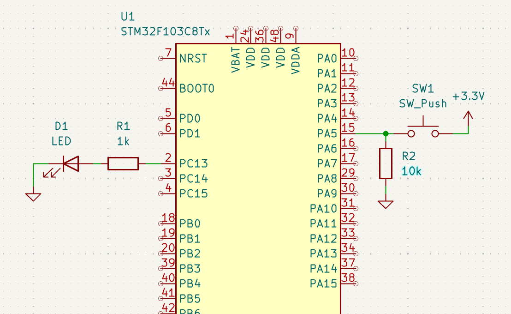
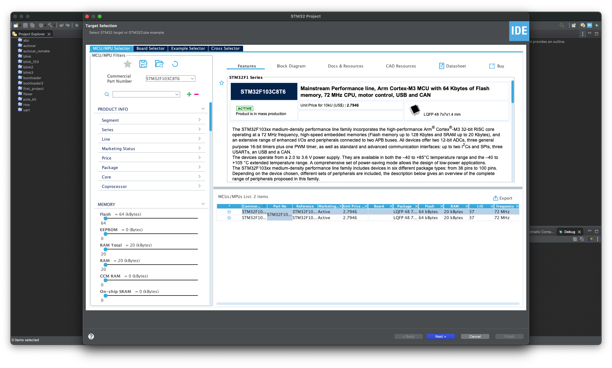
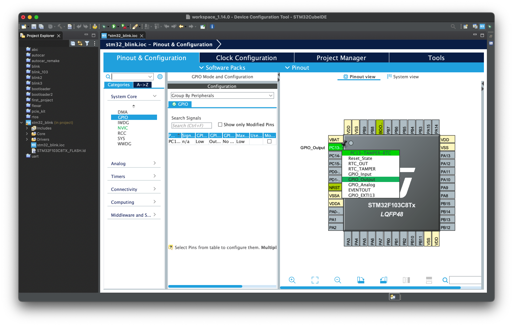
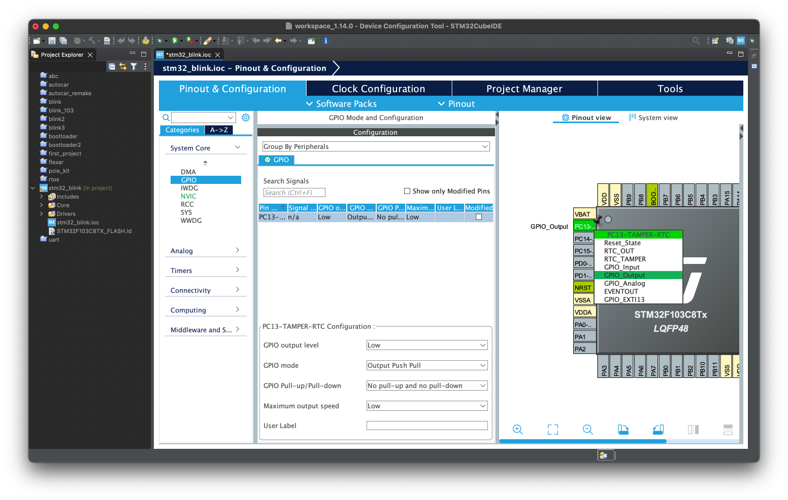
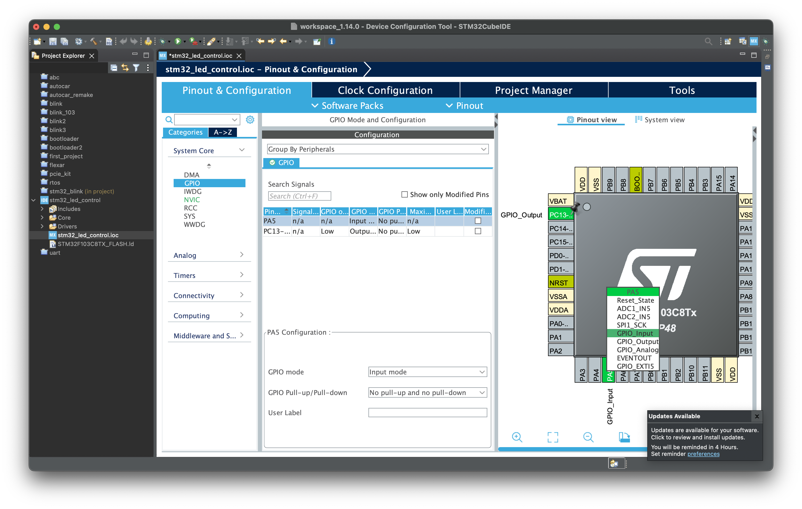

# Bài 2: Lập trình GPIO cho vi điều khiển STM32F103C8T6

**GPIO** (**G**eneral **P**urpose **I**nput/**O**utput) là các chân tín hiệu trên vi điều khiển, có thể cấu hình để hoạt động ở chế độ ngõ ra, ngõ vào hoặc cả hai, và có thể điều khiển trong khi hoạt động. Bài viết này sẽ tìm hiểu về GPIO trên vi điều khiển STM32F103C8T6.

## Mục lục

- [Bài 2: Lập trình GPIO cho vi điều khiển STM32F103C8T6](#bài-2-lập-trình-gpio-cho-vi-điều-khiển-stm32f103c8t6)
  - [Mục lục](#mục-lục)
  - [1. Kiến thức cần có](#1-kiến-thức-cần-có)
  - [2. Mục tiêu bài học](#2-mục-tiêu-bài-học)
  - [3. GPIO trên vi điều khiển STM32F103](#3-gpio-trên-vi-điều-khiển-stm32f103)
    - [3.1 Các cổng GPIO](#31-các-cổng-gpio)
    - [3.2 Các thông số của GPIO](#32-các-thông-số-của-gpio)
    - [3.3 Thư viện HAL\_GPIO](#33-thư-viện-hal_gpio)
  - [4. Project: Nháy đèn led](#4-project-nháy-đèn-led)
    - [4.1 Tạo project](#41-tạo-project)
    - [4.2 Cấu hình GPIO trên STM32CubeMX](#42-cấu-hình-gpio-trên-stm32cubemx)
    - [4.3 Code](#43-code)
    - [4.4 Kết quả](#44-kết-quả)
  - [5. Project: Điều khiển đèn bằng nút nhấn](#5-project-điều-khiển-đèn-bằng-nút-nhấn)
    - [5.1 Tạo project và cấu hình GPIO](#51-tạo-project-và-cấu-hình-gpio)
    - [5.2 Code](#52-code)
    - [5.3 Kết quả](#53-kết-quả)
  - [6. Câu hỏi và bài tập](#6-câu-hỏi-và-bài-tập)
    - [Câu hỏi:](#câu-hỏi)
    - [Bài tập:](#bài-tập)
  - [7. Tài liệu tham khảo](#7-tài-liệu-tham-khảo)


## 1. Kiến thức cần có

- Bài 1:  Giới thiệu STM32, sử dụng STM32CubeIDE và thư viện HAL

## 2. Mục tiêu bài học

- Hiểu nguyên lý hoạt động của GPIO trên vi điều khiển STM32.
- Học cách cấu hình chân GPIO trên giao diện của STM32CubeMX.
- Học cách sử dụng thư viện HAL_GPIO để lập trình GPIO.

## 3. GPIO trên vi điều khiển STM32F103

### 3.1 Các cổng GPIO

Trên STM32F103C8T6 có 37 chân GPIO. Các chân GPIO được chia thành nhiều cổng (port), gồm:

- GPIOA: Các chân PA0 - PA15.
- GPIOB: Các chân PB0 - PB15.
- GPIOC: Các chân PC13 - PC15.
- GPIOD: Các chân PD0 - PD1.

### 3.2 Các thông số của GPIO

- Điện áp và dòng điện: Mức cao 3.3V, mức thấp 0V. Dòng điện tối đa 25mA.
- Chế độ: Ngõ ra (push-pull hoặc open-drain), ngõ vào (input), ngõ ra/vào cho ngoại vi (alternaltive push-pull), ngắt ngoài (external interrupt).
- Trở kéo: Trở kéo lên (pull up), kéo xuống (pull down) hoặc không có.
- Tốc độ tối đa: Tốc độ thay đổi tín hiệu trên chân GPIO. Có ba mức độ: thấp, trung bình, cao.

### 3.3 Thư viện HAL_GPIO

Thư viện **HAL_GPIO** nằm trong thư viện **HAL** (**H**ardware **A**btraction **L**ayer) viết cho STM32. Thư viện này cung cấp các cấu trúc và hàm để cấu hình và điều khiển GPIO của STM32. Một số hàm thường dùng:

``` c++
/* Thay đổi ngõ ra của chân GPIO */
void HAL_GPIO_WritePin(GPIO_TypeDef *GPIOx, uint16_t GPIO_Pin, GPIO_PinState PinState);

/* Đảo trạng thái ngõ ra của chân GPIO */ 
void HAL_GPIO_TogglePin(GPIO_TypeDef *GPIOx, uint16_t GPIO_Pin);

/* Đọc và trả về giá trị của chân GPIO */
GPIO_PinState HAL_GPIO_ReadPin(GPIO_TypeDef *GPIOx, uint16_t GPIO_Pin);
```
Thư viện HAL còn cung cấp hàm delay:

```c++
/* Delay (đơn vị: ms) */
void HAL_Delay(uint32_t Delay);
```

## 4. Project: Nháy đèn led

Đây là một project đơn giản, sử dụng thư viện HAL_GPIO để điều khiển đèn led chớp tắt. Project thực hiện trên vi điều khiển STM32F103C8T6, sử phần mềm STM32CubeIDE.

Sơ đồ mạch điện dùng cho cả 2 project:



### 4.1 Tạo project

Trên phần mềm STM32CubeIDE, chọn **File** > **New** > **STM32 Project**. Tìm **STM32F103C8T6**.



Chọn **Next**. Đặt tên cho project rồi chọn **Finish**.

### 4.2 Cấu hình GPIO trên STM32CubeMX

Trên giao diện của STM32CubeMX, chọn tab **Pinout & Configuration**. Chọn chân GPIO muốn sử dụng trên con chip, ví dụ chân PC13 (chân này nối với led trên mạch phát triển); sau đó chọn GPIO_Output.



Trong bảng chọn ở **System Core** > **GPIO** hiện danh sách các chân GPIO đã cấu hình. Chọn PC13. Có thể tùy ý điều chỉnh các thông số của chân này, gồm:

- GPIO output level: Ngõ ra mặc định là mức cao hay thấp
- GPIO mode: ngõ ra là push-pull hoặc open-drain
- GPIO Pull-up/Pull-down: Trở kéo lên (pull up), kéo xuống (pull down) hoặc không có.
- Maximum output speed: Tốc độ tối đa của chân GPIO
- User label: Tên do người dùng đặt



Bấm **Ctrl+S** để lưu lại.

### 4.3 Code

Code tự động được tạo trong **main.c**:

```c++
/* USER CODE BEGIN Header */
/**
  ******************************************************************************
  * @file           : main.c
  * @brief          : Main program body
  ******************************************************************************
  * @attention
  *
  * Copyright (c) 2024 STMicroelectronics.
  * All rights reserved.
  *
  * This software is licensed under terms that can be found in the LICENSE file
  * in the root directory of this software component.
  * If no LICENSE file comes with this software, it is provided AS-IS.
  *
  ******************************************************************************
  */
/* USER CODE END Header */
/* Includes ------------------------------------------------------------------*/
#include "main.h"

/* Private includes ----------------------------------------------------------*/
/* USER CODE BEGIN Includes */

/* USER CODE END Includes */

/* Private typedef -----------------------------------------------------------*/
/* USER CODE BEGIN PTD */

/* USER CODE END PTD */

/* Private define ------------------------------------------------------------*/
/* USER CODE BEGIN PD */

/* USER CODE END PD */

/* Private macro -------------------------------------------------------------*/
/* USER CODE BEGIN PM */

/* USER CODE END PM */

/* Private variables ---------------------------------------------------------*/

/* USER CODE BEGIN PV */

/* USER CODE END PV */

/* Private function prototypes -----------------------------------------------*/
void SystemClock_Config(void);
static void MX_GPIO_Init(void);
/* USER CODE BEGIN PFP */

/* USER CODE END PFP */

/* Private user code ---------------------------------------------------------*/
/* USER CODE BEGIN 0 */

/* USER CODE END 0 */

/**
  * @brief  The application entry point.
  * @retval int
  */
int main(void)
{
  /* USER CODE BEGIN 1 */

  /* USER CODE END 1 */

  /* MCU Configuration--------------------------------------------------------*/

  /* Reset of all peripherals, Initializes the Flash interface and the Systick. */
  HAL_Init();

  /* USER CODE BEGIN Init */

  /* USER CODE END Init */

  /* Configure the system clock */
  SystemClock_Config();

  /* USER CODE BEGIN SysInit */

  /* USER CODE END SysInit */

  /* Initialize all configured peripherals */
  MX_GPIO_Init();
  /* USER CODE BEGIN 2 */

  /* USER CODE END 2 */

  /* Infinite loop */
  /* USER CODE BEGIN WHILE */
  while (1)
  {
    /* USER CODE END WHILE */

    /* USER CODE BEGIN 3 */
  }
  /* USER CODE END 3 */
}

/**
  * @brief System Clock Configuration
  * @retval None
  */
void SystemClock_Config(void)
{
  RCC_OscInitTypeDef RCC_OscInitStruct = {0};
  RCC_ClkInitTypeDef RCC_ClkInitStruct = {0};

  /** Initializes the RCC Oscillators according to the specified parameters
  * in the RCC_OscInitTypeDef structure.
  */
  RCC_OscInitStruct.OscillatorType = RCC_OSCILLATORTYPE_HSI;
  RCC_OscInitStruct.HSIState = RCC_HSI_ON;
  RCC_OscInitStruct.HSICalibrationValue = RCC_HSICALIBRATION_DEFAULT;
  RCC_OscInitStruct.PLL.PLLState = RCC_PLL_NONE;
  if (HAL_RCC_OscConfig(&RCC_OscInitStruct) != HAL_OK)
  {
    Error_Handler();
  }

  /** Initializes the CPU, AHB and APB buses clocks
  */
  RCC_ClkInitStruct.ClockType = RCC_CLOCKTYPE_HCLK|RCC_CLOCKTYPE_SYSCLK
                              |RCC_CLOCKTYPE_PCLK1|RCC_CLOCKTYPE_PCLK2;
  RCC_ClkInitStruct.SYSCLKSource = RCC_SYSCLKSOURCE_HSI;
  RCC_ClkInitStruct.AHBCLKDivider = RCC_SYSCLK_DIV1;
  RCC_ClkInitStruct.APB1CLKDivider = RCC_HCLK_DIV1;
  RCC_ClkInitStruct.APB2CLKDivider = RCC_HCLK_DIV1;

  if (HAL_RCC_ClockConfig(&RCC_ClkInitStruct, FLASH_LATENCY_0) != HAL_OK)
  {
    Error_Handler();
  }
}

/**
  * @brief GPIO Initialization Function
  * @param None
  * @retval None
  */
static void MX_GPIO_Init(void)
{
  GPIO_InitTypeDef GPIO_InitStruct = {0};
/* USER CODE BEGIN MX_GPIO_Init_1 */
/* USER CODE END MX_GPIO_Init_1 */

  /* GPIO Ports Clock Enable */
  __HAL_RCC_GPIOC_CLK_ENABLE();

  /*Configure GPIO pin Output Level */
  HAL_GPIO_WritePin(GPIOC, GPIO_PIN_13, GPIO_PIN_RESET);

  /*Configure GPIO pin : PC13 */
  GPIO_InitStruct.Pin = GPIO_PIN_13;
  GPIO_InitStruct.Mode = GPIO_MODE_OUTPUT_PP;
  GPIO_InitStruct.Pull = GPIO_NOPULL;
  GPIO_InitStruct.Speed = GPIO_SPEED_FREQ_LOW;
  HAL_GPIO_Init(GPIOC, &GPIO_InitStruct);

/* USER CODE BEGIN MX_GPIO_Init_2 */
/* USER CODE END MX_GPIO_Init_2 */
}

/* USER CODE BEGIN 4 */

/* USER CODE END 4 */

/**
  * @brief  This function is executed in case of error occurrence.
  * @retval None
  */
void Error_Handler(void)
{
  /* USER CODE BEGIN Error_Handler_Debug */
  /* User can add his own implementation to report the HAL error return state */
  __disable_irq();
  while (1)
  {
  }
  /* USER CODE END Error_Handler_Debug */
}

#ifdef  USE_FULL_ASSERT
/**
  * @brief  Reports the name of the source file and the source line number
  *         where the assert_param error has occurred.
  * @param  file: pointer to the source file name
  * @param  line: assert_param error line source number
  * @retval None
  */
void assert_failed(uint8_t *file, uint32_t line)
{
  /* USER CODE BEGIN 6 */
  /* User can add his own implementation to report the file name and line number,
     ex: printf("Wrong parameters value: file %s on line %d\r\n", file, line) */
  /* USER CODE END 6 */
}
#endif /* USE_FULL_ASSERT */

```

Giải thích: Sau khi cấu hình chân GPIO trong STM32CubeMX, phầm mềm tự động tạo ra hàm `MX_GPIO_Init()` và gọi trong hàm `main()`. Hàm `MX_GPIO_Init()` cấu hình chân PC13 tương ứng với cấu hình đã thay đổi trên STM32CubeMX.

Để điều khiển chân PC13, ta dùng hàm `HAL_GPIO_WritePin()` và `HAL_Delay()` trong khối `while()`:

```c++
while (1) {
	/* USER CODE END WHILE */

	/* USER CODE BEGIN 3 */
	HAL_GPIO_WritePin(GPIOC, GPIO_PIN_13, GPIO_PIN_SET);
	HAL_Delay(500);
	HAL_GPIO_WritePin(GPIOC, GPIO_PIN_13, GPIO_PIN_RESET);
	HAL_Delay(500);
}
```

Hoặc dùng hàm `HAL_GPIO_TogglePin()`:

```c++
while (1) {
	/* USER CODE END WHILE */

	/* USER CODE BEGIN 3 */
	HAL_GPIO_TogglePin(GPIOC, GPIO_PIN_13);
	HAL_Delay(500);
}
```

### 4.4 Kết quả

## 5. Project: Điều khiển đèn bằng nút nhấn

Project sử dụng một chân GPIO ngõ vào để đọc trạng thái nút nhấn và một chân GPIO ngõ ra để nháy sáng đèn led.

### 5.1 Tạo project và cấu hình GPIO

Tạo project mới. Trong phần cấu hình GPIO bằng STM32CubeMX, chọn một chân ngõ ra để điều khiển led và một chân ngõ vào để đọc nút nhấn. Ví dụ: PC13 để điều khiển led, PA5 làm chân ngõ vào đọc nút nhấn. Để cấu hình một chân là ngõ vào, ta nhấn vào chân đó rồi chọn GPIO_Input:


### 5.2 Code

Sau khi lưu, phần mềm sẽ tự động tạo code. Trong hàm `MX_GPIO_Init()` còn có thêm cấu hình của chân PA5.
Sử dụng hàm `HAL_GPIO_ReadPin()` để đọc chân tín hiệu, lưu vào biến `readValue`, dựa trên giá trị của `readValue` để lập trình cho đèn sáng. Code trong khối `while()`:

```c++
while (1)
{
/* USER CODE END WHILE */

/* USER CODE BEGIN 3 */
  uint8_t readValue = HAL_GPIO_ReadPin(GPIOA, GPIO_PIN_5);
  if(readValue == GPIO_PIN_SET){
	  HAL_GPIO_WritePin(GPIOC, GPIO_PIN_13, GPIO_PIN_SET);
  }
  else {
	  HAL_GPIO_WritePin(GPIOC, GPIO_PIN_13, GPIO_PIN_RESET);
  }
}
```

hoặc viết đơn giản hơn:

```c++
while (1)
{
/* USER CODE END WHILE */

/* USER CODE BEGIN 3 */
  uint8_t readValue = HAL_GPIO_ReadPin(GPIOA, GPIO_PIN_5);
  HAL_GPIO_WritePin(GPIOC, GPIO_PIN_13, readValue);
}
```

### 5.3 Kết quả

## 6. Câu hỏi và bài tập

### Câu hỏi: 
1. STM32F103C8T6 có mấy cổng GPIO? Liệt kê các chân GPIO thuộc từng cổng
2. Chức năng của các hàm `HAL_GPIO_WritePin()`, `HAL_GPIO_TogglePin()`, `HAL_GPIO_ReadPin()`, `HAL_Delay()`?
3. Cấu hình sau có nghĩa là gì (chân nào, ngõ ra/vào, trở kéo, tốc độ)?

```c++
/*Configure GPIO pin : PC13 */
GPIO_InitStruct.Pin = GPIO_PIN_13;
GPIO_InitStruct.Mode = GPIO_MODE_OUTPUT_PP;
GPIO_InitStruct.Pull = GPIO_NOPULL;
GPIO_InitStruct.Speed = GPIO_SPEED_FREQ_LOW;
HAL_GPIO_Init(GPIOC, &GPIO_InitStruct);
```
### Bài tập:
1. Lập trình led nháy với tần số tăng dần.
2. Lập trình led nháy tín hiệu SOS dùng morse code.
3. Bật tắt đèn bằng nút nhấn, mỗi lần nhấn nút, đèn sẽ tắt -> bật, bật -> tắt.
4. (Khó) Debouce cho nút nhấn bằng phần mềm (dùng hàm HAL_Delay()).

## 7. Tài liệu tham khảo

[1] STMicroelectronics, "Medium-density performance line Arm®-based 32-bit MCU with 64 or 128 KB Flash, USB, CAN, 7 timers, 2 ADCs, 9 com. interfaces", STM32F103Cx8/B Datasheet, Sep. 2023.

