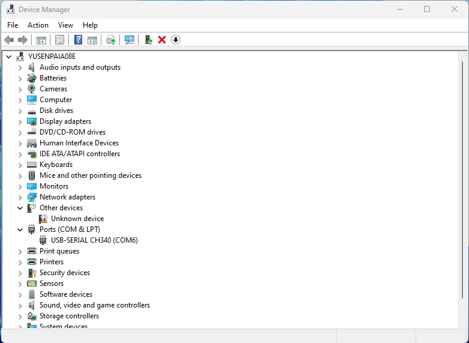
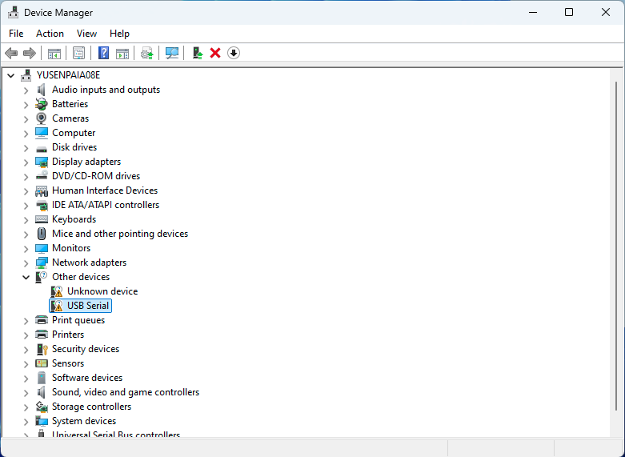
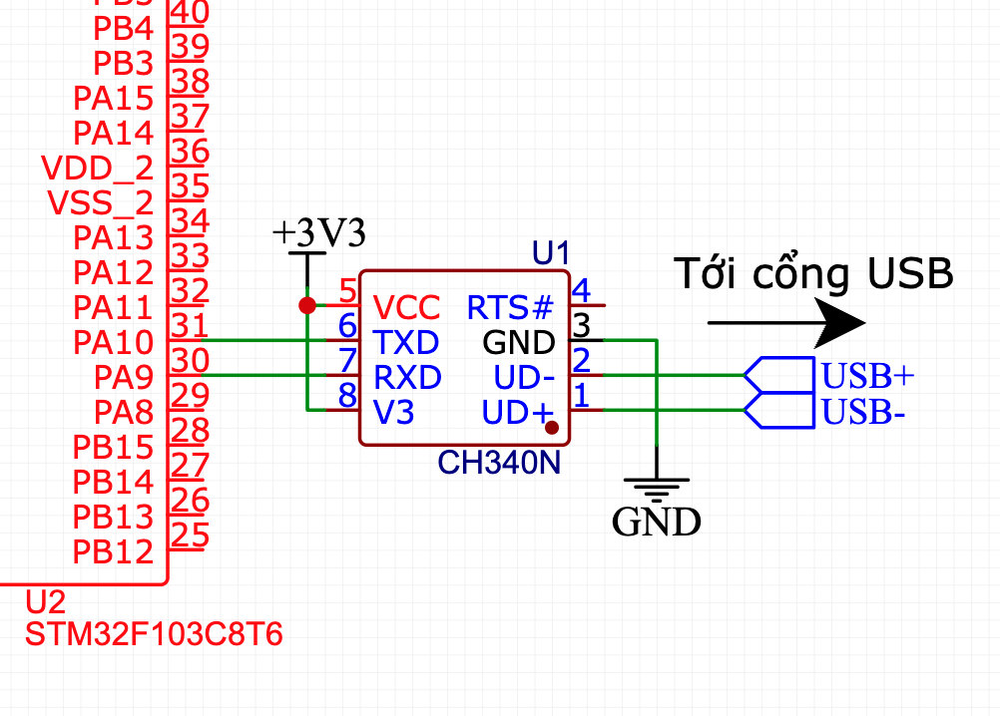
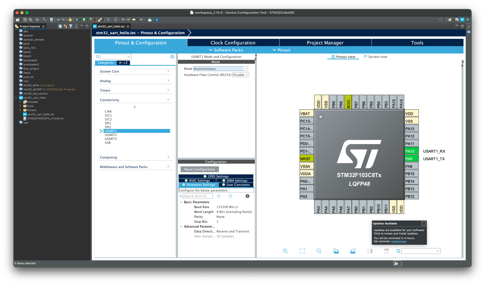
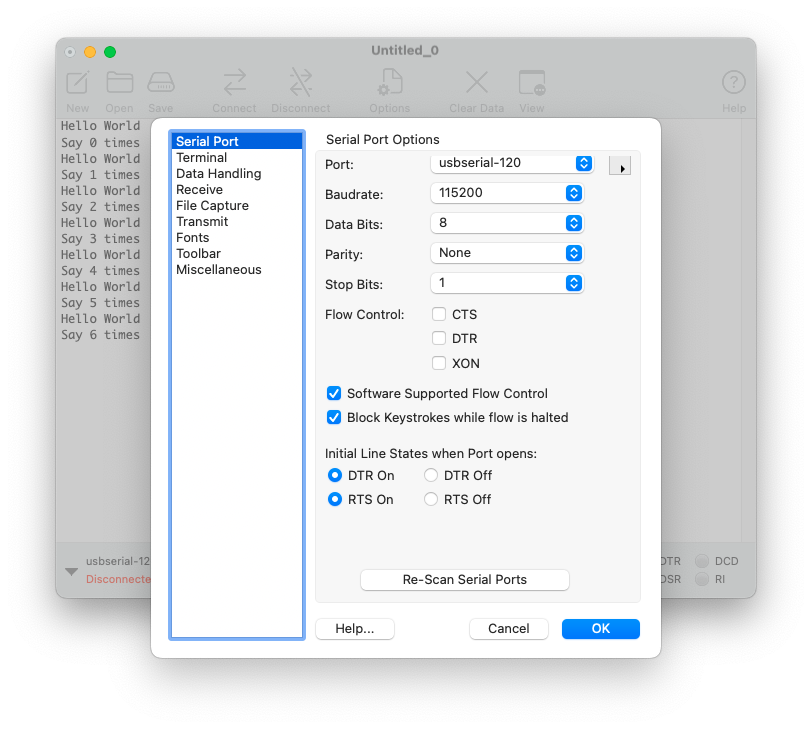
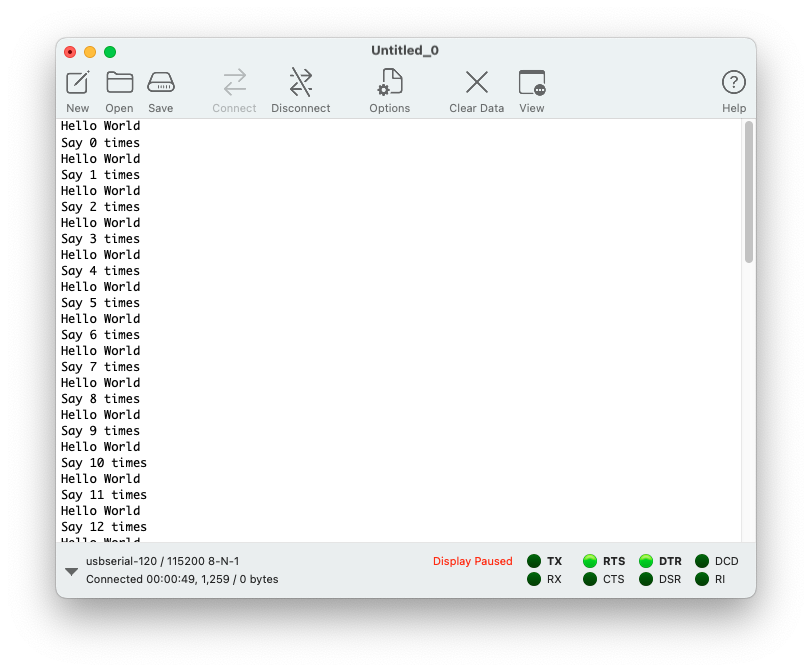

# Bài 3: Giao tiếp với máy tính qua cổng Serial

Cổng **Serial** (hay còn gọi là cổng nối tiếp) là một loại giao thức truyền thông dùng để trao đổi dữ liệu giữa các thiết bị thông qua một dây dẫn truyền tín hiệu nối tiếp. Cổng này từng rất phổ biến trong việc kết nối với các thiết bị ngoại vi như chuột, modem, máy in, và các thiết bị điều khiển công nghiệp.

Trên máy tính hiện đại, cổng Serial truyền thống thường bị thay thế bởi cổng USB, nhưng vẫn có thể sử dụng thông qua bộ chuyển đổi USB to Serial để kết nối với các thiết bị sử dụng giao thức này.

Bài viết này sẽ hướng dẫn cách giao tiếp với máy tính qua cổng Serial bằng vi điều khiển STM32F103C8T6

## Mục lục

- [Bài 3: Giao tiếp với máy tính qua cổng Serial](#bài-3-giao-tiếp-với-máy-tính-qua-cổng-serial)
  - [Mục lục](#mục-lục)
  - [Kiến thức cần có](#kiến-thức-cần-có)
  - [Mục tiêu bài học](#mục-tiêu-bài-học)
  - [Cổng Serial](#cổng-serial)
    - [Sử dụng cổng Serial](#sử-dụng-cổng-serial)
    - [Cài đặt Driver](#cài-đặt-driver)
  - [UART trên STM32F103](#uart-trên-stm32f103)
  - [Sơ đồ mạch điện](#sơ-đồ-mạch-điện)
  - [Project: In chữ "Hello World" lên Serial](#project-in-chữ-hello-world-lên-serial)
    - [Tạo project, cấu hình UART](#tạo-project-cấu-hình-uart)
    - [Một số hàm sử dụng](#một-số-hàm-sử-dụng)
    - [Code](#code)
    - [Xem Kết quả](#xem-kết-quả)
  - [Câu hỏi và bài tập](#câu-hỏi-và-bài-tập)
    - [Câu hỏi](#câu-hỏi)
    - [Bài tập](#bài-tập)
  - [Tài liệu tham khảo](#tài-liệu-tham-khảo)


## Kiến thức cần có
- [Bài 1 - Giới thiệu vi điều khiển STM32F103](<../Bài 1/Bài 1 - Giới thiệu vi điều khiển STM32, sử dụng STM32CubeIDE và thư viện HAL.md>)
- [Bài 2 - Lập trình GPIO cho vi điều khiển STM32F103C8T6](<../Bài 2/Bài 2 - Lập trình GPIO cho vi điều khiển STM32F103C8T6.md>)
## Mục tiêu bài học

- Làm quen với cổng Serial, giao thức UART, IC chuyển UART-USB.
- Học cách sử dụng một số hàm trong thư viện HAL_UART để giao tiếp với cổng Serial.

## Cổng Serial

Như đã giới thiệu, cổng Serial dùng để trao đổi dữ liệu giữa các thiết bị thông qua một dây dẫn truyền tín hiệu nối tiếp. Trong lập trình vi điều khiển, chúng thường được sử dụng để:

- Nạp chương trình.
- Truyền nhận dữ liệu với vi điều khiển.

Do đó cổng Serial cực kỳ hữu ích khi ta cần kiểm tra lỗi (debug) chương trình hoặc in thông tin khi chạy chương trình.

### Sử dụng cổng Serial

Để sử dụng cổng Serial, trên máy tính cần cài đặt phần mềm giao tiếp Serial. Một số phần mềm thường được sử dụng:

- [CoolTerm](https://freeware.the-meiers.org)
- PuTTY
- Arduino IDE (sử dụng Serial Monitor)

Bài viết này sẽ sử dụng CoolTerm để giao tiếp Serial.

Trên Windows, các cổng Serial có tên gọi là **COMx** (COM1, COM2,...), các bạn có thể tìm trong Device Manager > Ports (COM & LPT). Khi bạn kết nối thiết bị tới máy tính, cổng COM mới sẽ được thêm vào:



Nếu không tìm thấy cổng COM thì máy tính chưa cài driver cho IC giao tiếp cổng Serial.




### Cài đặt Driver

Đa số máy tính hiện đại không có sẵn cổng nối dây Serial. Tuy nhiên ta vẫn có thể giả lập cổng này thông qua **cổng USB**, kết hợp với IC giao tiếp chuyển đổi UART sang USB, như CH340, CP2102, FT232. Các IC này thường được tích hợp trên các mạch vi điều khiển phổ biến, như Arduino Nano, ESP32,...

Trên máy tính cần cài đặt các driver phù hợp với IC sử dụng. Link cài đặt của một số driver:

- [CH340](https://wch-ic.com/downloads/CH341SER_EXE.html#carousel-example-generic)
- [CP2102](https://www.silabs.com/developers/usb-to-uart-bridge-vcp-drivers?tab=downloads)
- [FT232](https://ftdichip.com/drivers/vcp-drivers/)

Sau khi cài đặt driver, khi cắm thiết bị vào máy tính 

Bài viết này sử dụng CH340N làm IC giao tiếp.

## UART trên STM32F103

Về phía vi điều khiển, STM32F103 giao tiếp với CH340 qua giao tiếp UART. UART (**U**niversal **A**synchronous **R**eceiver/**T**ransmitter) là một loại giao tiếp truyền thông nối tiếp giữa các thiết bị. Giao tiếp này là **không đồng bộ**, tức là không cần dây tín hiệu clock chung giữa các thiết bị. Thay vào đó, các thiết bị phải dùng chung một tốc độ truyền dữ liệu, gọi là **tốc độ baud** (baud rate).

Một số thông số của giao tiếp UART:

- Chế độ truyền: Song công (full duplex) - hỗ trợ truyền và nhận dữ liệu cùng lúc. UART gồm hai tín hiệu: TX để truyển đi và RX để nhận về.
- Tốc độ baud (baud rate): Quy định tốc độ truyền. Các thiết bị cùng tốc độ baud mới có thể giao tiếp được với nhau.
- Data bits: Số bit có trong một lần truyền. Thường là 8 bit.
- Parity: Là bit được thêm vào cuối cho mục đích sửa lỗi.

STM32F103C8T6 có tới 3 ngoại vi UART. UART1 sử dụng các chân:
- PA9: UART_TX
- PA10: UART_RX

## Sơ đồ mạch điện

Sơ đồ kết nối giữa STM32 và CH340N như sơ đồ sau:



> Lưu ý: TX của thiết bị này nối RX của thiết bị kia. TX của CH340N nối với RX của STM32 (PA10), RX của CH340N nối với TX của STM32 (PA9)

## Project: In chữ "Hello World" lên Serial

### Tạo project, cấu hình UART

Tạo project mới trong STM32CubeIDE. Trong giao diện của STM32CubeMX, trong phần Pinout & Configuration > Connectivity > USART1, bảng chọn USART1 Configuration Mode sẽ hiện ra. Chuyển Mode thành Asynchronous:



Trong bảng Configuration là các thông số của UART. Các thông số gồm:

- Baud Rate: 115200 Bits/s - Tốc độ baud là 115200 bit/giây
- Word Length: 8 bit (include parity) - Truyền 8 bit trong một lần (tính cả parity). Nếu muốn truyền 8 bit và thêm cả parity thì phải sửa thông số này thành 9 bit (include parity).
- Parity: None - Không có parity. Có thể sửa thành Even (parity chẵn) hoặc Odd (parity lẻ).
- Stop bits: 0 - Số bit dừng (là bit kết thúc quá trình truyền).

Các thông số để giá trị mặc định. Sau đó lưu lại (Ctrl + S) và để phần mềm tự động tạo code.

### Một số hàm sử dụng

Các hàm được cung cấp bởi thư viện HAL_UART. Một số hàm dùng phổ biến:

```c++
/*  */
/**
  * @brief  Gửi dữ liệu đi trong chế độ blocking - sẽ dừng chương trình cho tới khi gửi hết số byte hoặc hết Timeout
  * @param  huart Con trỏ tới cấu trúc UART sử dụng
  * @param  pData Con trỏ tới mảng dữ liệu cần gửi đi
  * @param  Size  Số lượng dữ liệu gửi đi (số byte)
  * @param  Timeout Thời gian chờ. Hết thời gian này mà UART chưa truyền xong
  * 		thì hàm trả về HAL_TIMEOUT
  * @retval trả về HAL_OK nếu thành công, ngược lại trả về HAL_ERROR. 
  * 		Nếu UART đang bận thì trả về HAL_BUSY
  */
HAL_StatusTypeDef HAL_UART_Transmit(UART_HandleTypeDef *huart, const uint8_t *pData, 
									uint16_t Size, uint32_t Timeout)

/**
  * @brief  Nhận dữ liệu đi trong chế độ blocking - sẽ dừng chương trình cho tới khi nhận đủ số byte hoặc hết Timeout.
  * @param  huart Con trỏ tới cấu trúc UART sử dụng
  * @param  pData Con trỏ tới mảng nhận dữ liệu
  * @param  Size  Số lượng dữ liệu nhận về (số byte)
  * @param  Timeout Thời gian chờ. Hết thời gian này mà UART chưa nhận xong
  * 		thì hàm trả về HAL_TIMEOUT
  * @retval trả về HAL_OK nếu thành công, ngược lại trả về HAL_ERROR. 
  * 		Nếu UART đang bận thì trả về HAL_BUSY
  */

HAL_StatusTypeDef HAL_UART_Receive(UART_HandleTypeDef *huart, uint8_t *pData, 
									uint16_t Size, uint32_t Timeout);
```

### Code

Code được tạo tự động trong file **main.c**

```c++
/* USER CODE BEGIN Header */
/**
  ******************************************************************************
  * @file           : main.c
  * @brief          : Main program body
  ******************************************************************************
  * @attention
  *
  * Copyright (c) 2024 STMicroelectronics.
  * All rights reserved.
  *
  * This software is licensed under terms that can be found in the LICENSE file
  * in the root directory of this software component.
  * If no LICENSE file comes with this software, it is provided AS-IS.
  *
  ******************************************************************************
  */
/* USER CODE END Header */
/* Includes ------------------------------------------------------------------*/
#include "main.h"

/* Private includes ----------------------------------------------------------*/
/* USER CODE BEGIN Includes */

/* USER CODE END Includes */

/* Private typedef -----------------------------------------------------------*/
/* USER CODE BEGIN PTD */

/* USER CODE END PTD */

/* Private define ------------------------------------------------------------*/
/* USER CODE BEGIN PD */

/* USER CODE END PD */

/* Private macro -------------------------------------------------------------*/
/* USER CODE BEGIN PM */

/* USER CODE END PM */

/* Private variables ---------------------------------------------------------*/
UART_HandleTypeDef huart1;

/* USER CODE BEGIN PV */

/* USER CODE END PV */

/* Private function prototypes -----------------------------------------------*/
void SystemClock_Config(void);
static void MX_GPIO_Init(void);
static void MX_USART1_UART_Init(void);
/* USER CODE BEGIN PFP */

/* USER CODE END PFP */

/* Private user code ---------------------------------------------------------*/
/* USER CODE BEGIN 0 */

/* USER CODE END 0 */

/**
  * @brief  The application entry point.
  * @retval int
  */
int main(void)
{
  /* USER CODE BEGIN 1 */

  /* USER CODE END 1 */

  /* MCU Configuration--------------------------------------------------------*/

  /* Reset of all peripherals, Initializes the Flash interface and the Systick. */
  HAL_Init();

  /* USER CODE BEGIN Init */

  /* USER CODE END Init */

  /* Configure the system clock */
  SystemClock_Config();

  /* USER CODE BEGIN SysInit */

  /* USER CODE END SysInit */

  /* Initialize all configured peripherals */
  MX_GPIO_Init();
  MX_USART1_UART_Init();
  /* USER CODE BEGIN 2 */

  /* USER CODE END 2 */

  /* Infinite loop */
  /* USER CODE BEGIN WHILE */
  while (1)
  {
    /* USER CODE END WHILE */

    /* USER CODE BEGIN 3 */
  }
  /* USER CODE END 3 */
}

/**
  * @brief System Clock Configuration
  * @retval None
  */
void SystemClock_Config(void)
{
  RCC_OscInitTypeDef RCC_OscInitStruct = {0};
  RCC_ClkInitTypeDef RCC_ClkInitStruct = {0};

  /** Initializes the RCC Oscillators according to the specified parameters
  * in the RCC_OscInitTypeDef structure.
  */
  RCC_OscInitStruct.OscillatorType = RCC_OSCILLATORTYPE_HSI;
  RCC_OscInitStruct.HSIState = RCC_HSI_ON;
  RCC_OscInitStruct.HSICalibrationValue = RCC_HSICALIBRATION_DEFAULT;
  RCC_OscInitStruct.PLL.PLLState = RCC_PLL_NONE;
  if (HAL_RCC_OscConfig(&RCC_OscInitStruct) != HAL_OK)
  {
    Error_Handler();
  }

  /** Initializes the CPU, AHB and APB buses clocks
  */
  RCC_ClkInitStruct.ClockType = RCC_CLOCKTYPE_HCLK|RCC_CLOCKTYPE_SYSCLK
                              |RCC_CLOCKTYPE_PCLK1|RCC_CLOCKTYPE_PCLK2;
  RCC_ClkInitStruct.SYSCLKSource = RCC_SYSCLKSOURCE_HSI;
  RCC_ClkInitStruct.AHBCLKDivider = RCC_SYSCLK_DIV1;
  RCC_ClkInitStruct.APB1CLKDivider = RCC_HCLK_DIV1;
  RCC_ClkInitStruct.APB2CLKDivider = RCC_HCLK_DIV1;

  if (HAL_RCC_ClockConfig(&RCC_ClkInitStruct, FLASH_LATENCY_0) != HAL_OK)
  {
    Error_Handler();
  }
}

/**
  * @brief USART1 Initialization Function
  * @param None
  * @retval None
  */
static void MX_USART1_UART_Init(void)
{

  /* USER CODE BEGIN USART1_Init 0 */

  /* USER CODE END USART1_Init 0 */

  /* USER CODE BEGIN USART1_Init 1 */

  /* USER CODE END USART1_Init 1 */
  huart1.Instance = USART1;
  huart1.Init.BaudRate = 115200;
  huart1.Init.WordLength = UART_WORDLENGTH_8B;
  huart1.Init.StopBits = UART_STOPBITS_1;
  huart1.Init.Parity = UART_PARITY_NONE;
  huart1.Init.Mode = UART_MODE_TX_RX;
  huart1.Init.HwFlowCtl = UART_HWCONTROL_NONE;
  huart1.Init.OverSampling = UART_OVERSAMPLING_16;
  if (HAL_UART_Init(&huart1) != HAL_OK)
  {
    Error_Handler();
  }
  /* USER CODE BEGIN USART1_Init 2 */

  /* USER CODE END USART1_Init 2 */

}

/**
  * @brief GPIO Initialization Function
  * @param None
  * @retval None
  */
static void MX_GPIO_Init(void)
{
/* USER CODE BEGIN MX_GPIO_Init_1 */
/* USER CODE END MX_GPIO_Init_1 */

  /* GPIO Ports Clock Enable */
  __HAL_RCC_GPIOA_CLK_ENABLE();

/* USER CODE BEGIN MX_GPIO_Init_2 */
/* USER CODE END MX_GPIO_Init_2 */
}

/* USER CODE BEGIN 4 */

/* USER CODE END 4 */

/**
  * @brief  This function is executed in case of error occurrence.
  * @retval None
  */
void Error_Handler(void)
{
  /* USER CODE BEGIN Error_Handler_Debug */
  /* User can add his own implementation to report the HAL error return state */
  __disable_irq();
  while (1)
  {
  }
  /* USER CODE END Error_Handler_Debug */
}

#ifdef  USE_FULL_ASSERT
/**
  * @brief  Reports the name of the source file and the source line number
  *         where the assert_param error has occurred.
  * @param  file: pointer to the source file name
  * @param  line: assert_param error line source number
  * @retval None
  */
void assert_failed(uint8_t *file, uint32_t line)
{
  /* USER CODE BEGIN 6 */
  /* User can add his own implementation to report the file name and line number,
     ex: printf("Wrong parameters value: file %s on line %d\r\n", file, line) */
  /* USER CODE END 6 */
}
#endif /* USE_FULL_ASSERT */

```

Giải thích: Sau khi cấu hình UART trong STM32CubeMX, phần mềm tạo ra hai hàm `MX_GPIO_Init()` và `MX_USART1_UART_Init()`. Hàm `MX_GPIO_Init()` dùng để cấu hình chân PA9 và PA10 phù hợp với UART, hàm `MX_USART1_UART_Init()` dùng để cấu hình UART theo thống số đã cài đặt trong STM32CubeMX.

Ta thêm thư viện chuẩn `<string.h>` và `<stdio.h>`:
```c++
...
/* Private includes ----------------------------------------------------------*/
/* USER CODE BEGIN Includes */
#include <stdio.h>
#include <string.h>
/* USER CODE END Includes */
...
```

và viết đoạn code sau vào khối `while()`:

```c++
...
/* Infinite loop */
/* USER CODE BEGIN WHILE */
char msg[50];
while (1)
{
/* USER CODE END WHILE */

/* USER CODE BEGIN 3 */
	/* Tạo biến tĩnh i, để biến không biến mất khi lặp lại vòng while() */
	static uint8_t i = 0;

	/* Gửi chữ Hello World lên Serial. Ký tự \n để xuống dòng. Hàm strlen() trong thư viện chuẩn tính độ dài của chuỗi */
	HAL_UART_Transmit(&huart1, (uint8_t *) "Hello World\n", strlen("Hello World\n"), 100);

	/* Lưu chuỗi vào mảng msg, với biến i thay đổi, rồi gửi lên Serial */
	sprintf(msg, "Say %d times\n", i);
	HAL_UART_Transmit(&huart1, (uint8_t *)msg, strlen(msg), 100);

	i++;
	HAL_Delay(1000);
}
/* USER CODE END 3 */
...
```

### Xem Kết quả

Mở phần mềm CoolTerm. Chọn Options. Bảng cài đặt cổng Serial hiện lên:

- Port: Cổng COM. Chọn cổng kết nối với vi điều khiển.
- Baudrate: Đặt thành 115200
- Data Bits: 8
- Parity: None
- Stop Bits: 1



Chọn OK. Sau đó nhấn Connect. Phần mềm sẽ nhận dữ liệu từ cổng Serial và in lên màn hình.



## Câu hỏi và bài tập

### Câu hỏi

1. Giao tiếp UART cần các chân tín hiệu nào ?
2. Để giao tiếp giữa hai thiết bị sử dụng UART, cần có chung thông số nào ?

### Bài tập

1. Sử dụng `HAL_UART_Receive()` để nhận dữ liệu về vi điểu khiển qua cổng Serial. Trên phần mềm CoolTerm, chọn Connection > Send String... để gửi một chuỗi qua cổng Serial.
2. Lập trình vi điều khiển để gửi trả lại bất kì dữ liệu nào nhận được từ cổng Serial. Ví dụ khi gửi từ máy tính dòng chữ "hello", thì vi điểu khiển sẽ đáp trả lại "hello". Gợi ý: dùng `HAL_UART_Receive()`, kết hợp với tham số `Timeout` để dừng chương trình cho tới khi nhận đủ 1 byte rồi gửi trả byte vừa nhận.

## Tài liệu tham khảo

[1] STMicroelectronics, "Medium-density performance line Arm®-based 32-bit MCU with 64 or 128 KB Flash, USB, CAN, 7 timers, 2 ADCs, 9 com. interfaces", STM32F103Cx8/B Datasheet, Sep. 2023.