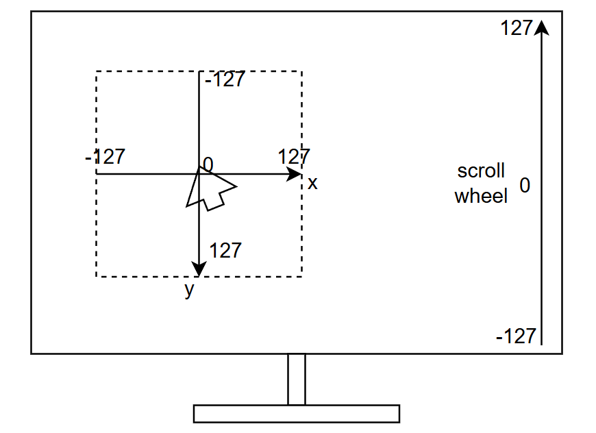
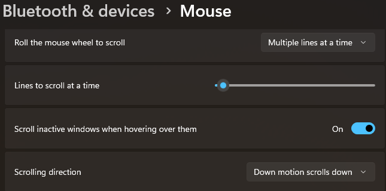
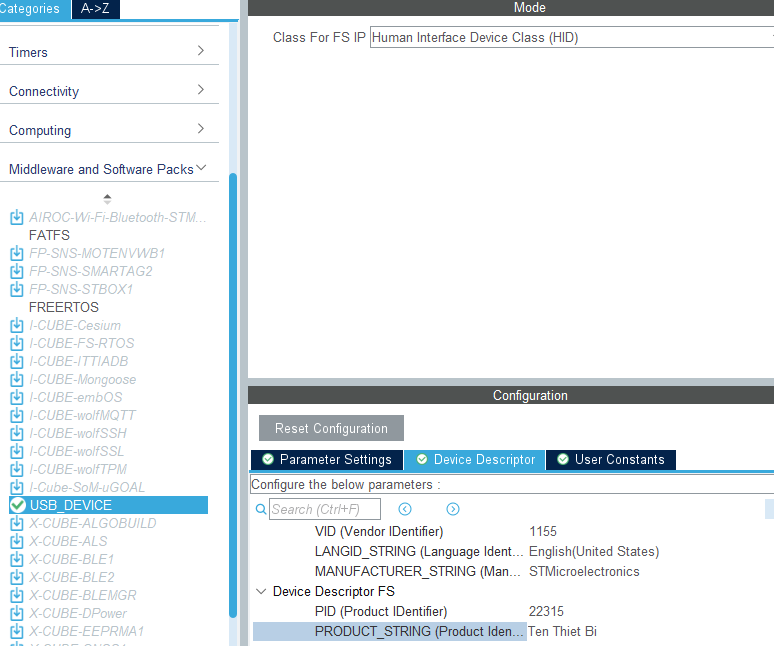
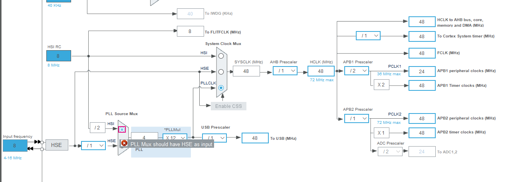
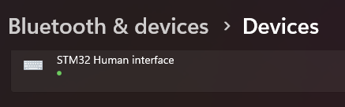

# Giao tiếp USB HID Mouse
## Giới thiệu
HID là viết tắt của Human Interface Device là một phân lớp trong tiêu chuẩn USB cho các thiết bị máy tính được vận hành bởi con người. Nói theo cách chi tiết hơn, HID là một tiêu chuẩn được tạo ra để đơn giản hóa quá trình cài đặt thiết bị đầu vào.

HID chủ yếu được sử dụng cho các thiết bị cho phép con người điều khiển máy tính. Khi sử dụng các thiết bị này, máy tính có thể phản ứng với các input của con người (ví dụ: chuyển động của chuột hoặc nhấn phím). Quá trình này phải diễn ra nhanh để người dùng máy tính không thấy độ trễ quá lâu giữa hành động của mình cho đến khi máy tính phản hồi. Các ví dụ điển hình cho các thiết bị lớp HID là:

- Keyboards và pointing devices (mouse, joysticks và trackballs).
- Front-panel controls (buttons, knobs, sliders, and switches).
- Các thiết bị mô phỏng (vô lăng, bàn đạp, các thiết bị đầu vào VR).
- Remote controls và telephone keypads.
- Các thiết bị tốc độ dữ liệu thấp khác cung cấp dữ liệu môi trường (nhiệt kế, đồng hồ đo năng lượng hoặc đầu đọc mã vạch).

## Mục lục
- [Giao tiếp USB HID Mouse](#giao-tiếp-usb-hid-mouse)
  - [Giới thiệu](#giới-thiệu)
  - [Mục lục](#mục-lục)
  - [Quá trình giao tiếp USB HID với máy tính](#quá-trình-giao-tiếp-usb-hid-với-máy-tính)
    - [HID Report Descriptor](#hid-report-descriptor)
    - [HID Report](#hid-report)
  - [Project: Nhấn button để gửi phím tới máy tính.](#project-nhấn-button-để-gửi-phím-tới-máy-tính)
    - [Cấu hình USB HID](#cấu-hình-usb-hid)
    - [Một số hàm và cấu trúc sử dụng](#một-số-hàm-và-cấu-trúc-sử-dụng)
    - [Code](#code)
    - [Quá trình nạp code và kết nối USB](#quá-trình-nạp-code-và-kết-nối-usb)

## Quá trình giao tiếp USB HID với máy tính
Sau khi cắm dây USB kết nối STM32 với máy tính:
- Máy tính gửi yêu cầu cấu hình USB.
- STM32 trả lời lại bằng cách gửi các Descriptor (bao gồm HID Report Descriptor).
- Máy tính đọc HID Report Descriptor từ thiết bị để xác định cấu trúc và nội dung của các report.
- STM32 gửi HID Report tới máy tính khi có sự kiện liên quan đến mouse xảy ra, máy tính xử lý report rồi tiếp tục nhận report tiếp theo.

Vì thiết bị HID có thể gửi dữ liệu tại bất kỳ thời điểm nào, nên máy tính cần đảm bảo rằng dữ liệu được lấy mẫu định kỳ.
### HID Report Descriptor

HID Report Descriptor là một trong những Descriptor mà USB Host (máy tính) yêu cầu từ USB Device (STM32/Mouse) khi bắt đầu giao tiếp. Trước khi STM32 gửi HID Report tới máy tính, STM32 sẽ gửi HID Report Descriptor để mô tả cấu trúc và nội dung của các report.

Report Descriptor chỉ gửi lần đầu, máy tính lưu trữ thông tin từ HID Report Descriptor để sử dụng trong suốt thời gian thiết bị hoạt động. Report Descriptor của mouse mặc định được tạo sẵn trong file usbd_hid.c ở Middlewares/ST/STM32_USB_Device_Library/Class/HID/Src:
```c++
__ALIGN_BEGIN static uint8_t HID_MOUSE_ReportDesc[HID_MOUSE_REPORT_DESC_SIZE]  __ALIGN_END =
{
  0x05,   0x01,
  0x09,   0x02,
  0xA1,   0x01,
  0x09,   0x01,

  0xA1,   0x00,
  0x05,   0x09,
  0x19,   0x01,
  0x29,   0x03,

  0x15,   0x00,
  0x25,   0x01,
  0x95,   0x03,
  0x75,   0x01,

  0x81,   0x02,
  0x95,   0x01,
  0x75,   0x05,
  0x81,   0x01,

  0x05,   0x01,
  0x09,   0x30,
  0x09,   0x31,
  0x09,   0x38,

  0x15,   0x81,
  0x25,   0x7F,
  0x75,   0x08,
  0x95,   0x03,

  0x81,   0x06,
  0xC0,   0x09,
  0x3c,   0x05,
  0xff,   0x09,

  0x01,   0x15,
  0x00,   0x25,
  0x01,   0x75,
  0x01,   0x95,

  0x02,   0xb1,
  0x22,   0x75,
  0x06,   0x95,
  0x01,   0xb1,

  0x01,   0xc0
};
```
### HID Report
Một HID Report của mouse bao gồm 4 bytes:
- 1 byte Button
- 1 byte X
- 1 byte Y
- 1 byte Wheel
```c++
typedef struct {
	uint8_t BUTTON; // Click chuột trái/phải/giữa
	int8_t X; // Di chuyển chuột theo trục x
	int8_t Y; // Di chuyển chuột theo trục y
	int8_t WHEEL; // Lăn chuột lên/xuống
}mouseReport;
```
Mỗi bit trong byte BUTTON đại diện cho một nút nhấn của chuột:
|Bit|Phím|
|---|----|
|0|Left Click|
|1|Right Click|
|2|Middle Click|
|3-7|Không sử dụng|

Nếu không có phím nào được nhấn, BUTTON = 0x00.

Ví dụ:
- Chỉ nhấn Left Click: BUTTON = 0b00000001 = 0x01.
- Nhấn Left Click và Right Click: BUTTON = 0b00000011 = 0x03.
- Không nhấn: BUTTON = 0x00.

X và Y có giá trị từ -127 đến 127, dùng để di chuyển chuột theo trục x và y so với vị trí hiện tại, với chiều di chuyển như hình bên dưới. Có thể thay đổi khoảng cách di chuyển bằng cách tăng/giảm tốc độ chuột.



WHEEL cũng có giá trị từ -127 đến 127, có thể thay đổi khoảng cách scroll bằng `lines to scroll at a time` trong mouse setting. Với Scrolling direction `Down motion scrolls down` thì chiều lăn chuột như hình trên.


## Project: Nhấn button để gửi phím tới máy tính.
### Cấu hình USB HID
Cấu hình STM32F103 như sau:

- Đặt `PB0` và `PA7` thành `GPIO_Input`.
- Vào Connectivity/USB: check ô Device(FS), cấu hình để mặc định.
- Vào Middleware and Software Packs/USB_Device: Class For FS IP chọn Human Interface Device Class (HID). Trong phần Device Descriptor, đặt tên thiết bị hiện trên máy tính ở PRODUCT_STRING (Product Identifier).
- Optional: Sử dụng thạch anh ngoài. Ở project này thì vẫn có thể sử dụng HSI được.
- Vào Clock Configuration, để sử dụng USB thì chỉ có thể chọn PLLCLK là 48MHz hoặc 72MHz.
### Một số hàm và cấu trúc sử dụng
```c++
/* Cấu trúc HID Report của chuột */
typedef struct {
	uint8_t BUTTON;
	int8_t X;
	int8_t Y;
	int8_t WHEEL;
}mouseReport;
/* Hàm gửi report lên máy tính*/
uint8_t USBD_HID_SendReport(USBD_HandleTypeDef  *pdev, uint8_t *report, uint16_t len)
/*
* pdev: con trỏ đến cấu trúc dữ liệu đại diện cho thiết bị USB.
* report: con trỏ tới HID Report.
* len: độ dài report.
*/
```
### Code
File `main.c`:
```c++
/* USER CODE BEGIN Header */
/**
  ******************************************************************************
  * @file           : main.c
  * @brief          : Main program body
  ******************************************************************************
  * @attention
  *
  * Copyright (c) 2024 STMicroelectronics.
  * All rights reserved.
  *
  * This software is licensed under terms that can be found in the LICENSE file
  * in the root directory of this software component.
  * If no LICENSE file comes with this software, it is provided AS-IS.
  *
  ******************************************************************************
  */
/* USER CODE END Header */
/* Includes ------------------------------------------------------------------*/
#include "main.h"
#include "usb_device.h"

/* Private includes ----------------------------------------------------------*/
/* USER CODE BEGIN Includes */
#include "usbd_hid.h"
/* USER CODE END Includes */

/* Private typedef -----------------------------------------------------------*/
/* USER CODE BEGIN PTD */

/* USER CODE END PTD */

/* Private define ------------------------------------------------------------*/
/* USER CODE BEGIN PD */

/* USER CODE END PD */

/* Private macro -------------------------------------------------------------*/
/* USER CODE BEGIN PM */

/* USER CODE END PM */

/* Private variables ---------------------------------------------------------*/

/* USER CODE BEGIN PV */

/* USER CODE END PV */

/* Private function prototypes -----------------------------------------------*/
void SystemClock_Config(void);
static void MX_GPIO_Init(void);
/* USER CODE BEGIN PFP */

/* USER CODE END PFP */

/* Private user code ---------------------------------------------------------*/
/* USER CODE BEGIN 0 */
extern USBD_HandleTypeDef hUsbDeviceFS;

typedef struct {
	uint8_t BUTTON; // Click chuột trái/phải/giữa
	int8_t X; // Di chuyển chuột theo trục x
	int8_t Y; // Di chuyển chuột theo trục y
	int8_t WHEEL; // Lăn chuột lên/xuống
}mouseReport;

mouseReport HIDmouse = {0, 0, 0, 0};
/* USER CODE END 0 */

/**
  * @brief  The application entry point.
  * @retval int
  */
int main(void)
{

  /* USER CODE BEGIN 1 */

  /* USER CODE END 1 */

  /* MCU Configuration--------------------------------------------------------*/

  /* Reset of all peripherals, Initializes the Flash interface and the Systick. */
  HAL_Init();

  /* USER CODE BEGIN Init */

  /* USER CODE END Init */

  /* Configure the system clock */
  SystemClock_Config();

  /* USER CODE BEGIN SysInit */

  /* USER CODE END SysInit */

  /* Initialize all configured peripherals */
  MX_GPIO_Init();
  MX_USB_DEVICE_Init();
  /* USER CODE BEGIN 2 */

  /* USER CODE END 2 */

  /* Infinite loop */
  /* USER CODE BEGIN WHILE */
  uint8_t prevState1 = 0, prevState2 = 0, prevState3 = 0, prevState4 = 0;
  uint8_t state1, state2, state3, state4;
  while (1)
  {
    /* USER CODE END WHILE */

    /* USER CODE BEGIN 3 */
	  state1 = HAL_GPIO_ReadPin(GPIOB, GPIO_PIN_0);
	  state2 = HAL_GPIO_ReadPin(GPIOA, GPIO_PIN_7);
	  state3 = HAL_GPIO_ReadPin(GPIOA, GPIO_PIN_6);
	  state4 = HAL_GPIO_ReadPin(GPIOA, GPIO_PIN_5);
	  // Thả chuột trái
	  if(prevState1 == 1 && state1 == 0) {
		  HIDmouse.BUTTON = 0;
		  HIDmouse.X = 0;
		  HIDmouse.Y = 0;
		  HIDmouse.WHEEL = 0;
		  USBD_HID_SendReport(&hUsbDeviceFS, (uint8_t *)&HIDmouse, sizeof(HIDmouse));
	  }
	  // Nhấn chuột trái
	  if(prevState1 == 0 && state1) {
		  HIDmouse.BUTTON |= 1 << 0;
		  HIDmouse.X = 0;
		  HIDmouse.Y = 0;
		  HIDmouse.WHEEL = 0;
		  USBD_HID_SendReport(&hUsbDeviceFS, (uint8_t *)&HIDmouse, sizeof(HIDmouse));
	  }
	  // Thả chuột phải
	  if(prevState2 == 1 && state2 == 0) {
		  HIDmouse.BUTTON = 0;
		  HIDmouse.X = 0;
		  HIDmouse.Y = 0;
		  HIDmouse.WHEEL = 0;
		  USBD_HID_SendReport(&hUsbDeviceFS, (uint8_t *)&HIDmouse, sizeof(HIDmouse));
	  }
	  // Nhấn chuột phải
	  if(prevState2 == 0 && state2) {
		  HIDmouse.BUTTON |= 1 << 1;
		  HIDmouse.X = 0;
		  HIDmouse.Y = 0;
		  HIDmouse.WHEEL = 0;
		  USBD_HID_SendReport(&hUsbDeviceFS, (uint8_t *)&HIDmouse, sizeof(HIDmouse));
	  }

	  // Di chuyển chuột hướng qua phải lên trên
	  if(prevState3 == 0 && state3) {
		  HIDmouse.X = 50;
		  HIDmouse.Y = -100;
		  HIDmouse.WHEEL = 0;
		  USBD_HID_SendReport(&hUsbDeviceFS, (uint8_t *)&HIDmouse, sizeof(HIDmouse));
	  }

	  // Lăn chuột xuống
	  if(prevState4 == 0 && state4) {
		  HIDmouse.X = 0;
		  HIDmouse.Y = 0;
		  HIDmouse.WHEEL = -5;
		  USBD_HID_SendReport(&hUsbDeviceFS, (uint8_t *)&HIDmouse, sizeof(HIDmouse));
	  }

	  prevState1 = state1;
	  prevState2 = state2;
	  prevState3 = state3;
	  prevState4 = state4;
	  HAL_Delay(20);
  }
  /* USER CODE END 3 */
}

/**
  * @brief System Clock Configuration
  * @retval None
  */
void SystemClock_Config(void)
{
  RCC_OscInitTypeDef RCC_OscInitStruct = {0};
  RCC_ClkInitTypeDef RCC_ClkInitStruct = {0};
  RCC_PeriphCLKInitTypeDef PeriphClkInit = {0};

  /** Initializes the RCC Oscillators according to the specified parameters
  * in the RCC_OscInitTypeDef structure.
  */
  RCC_OscInitStruct.OscillatorType = RCC_OSCILLATORTYPE_HSI;
  RCC_OscInitStruct.HSIState = RCC_HSI_ON;
  RCC_OscInitStruct.HSICalibrationValue = RCC_HSICALIBRATION_DEFAULT;
  RCC_OscInitStruct.PLL.PLLState = RCC_PLL_ON;
  RCC_OscInitStruct.PLL.PLLSource = RCC_PLLSOURCE_HSI_DIV2;
  RCC_OscInitStruct.PLL.PLLMUL = RCC_PLL_MUL12;
  if (HAL_RCC_OscConfig(&RCC_OscInitStruct) != HAL_OK)
  {
    Error_Handler();
  }

  /** Initializes the CPU, AHB and APB buses clocks
  */
  RCC_ClkInitStruct.ClockType = RCC_CLOCKTYPE_HCLK|RCC_CLOCKTYPE_SYSCLK
                              |RCC_CLOCKTYPE_PCLK1|RCC_CLOCKTYPE_PCLK2;
  RCC_ClkInitStruct.SYSCLKSource = RCC_SYSCLKSOURCE_PLLCLK;
  RCC_ClkInitStruct.AHBCLKDivider = RCC_SYSCLK_DIV1;
  RCC_ClkInitStruct.APB1CLKDivider = RCC_HCLK_DIV2;
  RCC_ClkInitStruct.APB2CLKDivider = RCC_HCLK_DIV1;

  if (HAL_RCC_ClockConfig(&RCC_ClkInitStruct, FLASH_LATENCY_1) != HAL_OK)
  {
    Error_Handler();
  }
  PeriphClkInit.PeriphClockSelection = RCC_PERIPHCLK_USB;
  PeriphClkInit.UsbClockSelection = RCC_USBCLKSOURCE_PLL;
  if (HAL_RCCEx_PeriphCLKConfig(&PeriphClkInit) != HAL_OK)
  {
    Error_Handler();
  }
}

/**
  * @brief GPIO Initialization Function
  * @param None
  * @retval None
  */
static void MX_GPIO_Init(void)
{
  GPIO_InitTypeDef GPIO_InitStruct = {0};
/* USER CODE BEGIN MX_GPIO_Init_1 */
/* USER CODE END MX_GPIO_Init_1 */

  /* GPIO Ports Clock Enable */
  __HAL_RCC_GPIOA_CLK_ENABLE();
  __HAL_RCC_GPIOB_CLK_ENABLE();

  /*Configure GPIO pins : PA5 PA6 PA7 */
  GPIO_InitStruct.Pin = GPIO_PIN_5|GPIO_PIN_6|GPIO_PIN_7;
  GPIO_InitStruct.Mode = GPIO_MODE_INPUT;
  GPIO_InitStruct.Pull = GPIO_NOPULL;
  HAL_GPIO_Init(GPIOA, &GPIO_InitStruct);

  /*Configure GPIO pin : PB0 */
  GPIO_InitStruct.Pin = GPIO_PIN_0;
  GPIO_InitStruct.Mode = GPIO_MODE_INPUT;
  GPIO_InitStruct.Pull = GPIO_NOPULL;
  HAL_GPIO_Init(GPIOB, &GPIO_InitStruct);

/* USER CODE BEGIN MX_GPIO_Init_2 */
/* USER CODE END MX_GPIO_Init_2 */
}

/* USER CODE BEGIN 4 */

/* USER CODE END 4 */

/**
  * @brief  This function is executed in case of error occurrence.
  * @retval None
  */
void Error_Handler(void)
{
  /* USER CODE BEGIN Error_Handler_Debug */
  /* User can add his own implementation to report the HAL error return state */
  __disable_irq();
  while (1)
  {
  }
  /* USER CODE END Error_Handler_Debug */
}

#ifdef  USE_FULL_ASSERT
/**
  * @brief  Reports the name of the source file and the source line number
  *         where the assert_param error has occurred.
  * @param  file: pointer to the source file name
  * @param  line: assert_param error line source number
  * @retval None
  */
void assert_failed(uint8_t *file, uint32_t line)
{
  /* USER CODE BEGIN 6 */
  /* User can add his own implementation to report the file name and line number,
     ex: printf("Wrong parameters value: file %s on line %d\r\n", file, line) */
  /* USER CODE END 6 */
}
#endif /* USE_FULL_ASSERT */
```
Giải thích:

Thêm thư viện:
```c++
/* USER CODE BEGIN Includes */
#include "usbd_hid.h"
/* USER CODE END Includes */
```

Định nghĩa và khai báo:
```c++
extern USBD_HandleTypeDef hUsbDeviceFS;

typedef struct {
	uint8_t BUTTON; // Click chuột trái/phải/giữa
	int8_t X; // Di chuyển chuột theo trục x
	int8_t Y; // Di chuyển chuột theo trục y
	int8_t WHEEL; // Lăn chuột lên/xuống
}mouseReport;

mouseReport HIDmouse = {0, 0, 0, 0};
```

Trong hàm main:
```c++
/* USER CODE BEGIN WHILE */
uint8_t prevState1 = 0, prevState2 = 0;
uint8_t state1, state2;
while (1)
{
  /* USER CODE BEGIN WHILE */
  uint8_t prevState1 = 0, prevState2 = 0, prevState3 = 0, prevState4 = 0;
  uint8_t state1, state2, state3, state4;
  while (1)
  {
    /* USER CODE END WHILE */

    /* USER CODE BEGIN 3 */
	  state1 = HAL_GPIO_ReadPin(GPIOB, GPIO_PIN_0);
	  state2 = HAL_GPIO_ReadPin(GPIOA, GPIO_PIN_7);
	  state3 = HAL_GPIO_ReadPin(GPIOA, GPIO_PIN_6);
	  state4 = HAL_GPIO_ReadPin(GPIOA, GPIO_PIN_5);
	  // Thả chuột trái
	  if(prevState1 == 1 && state1 == 0) {
		  HIDmouse.BUTTON = 0;
		  HIDmouse.X = 0;
		  HIDmouse.Y = 0;
		  HIDmouse.WHEEL = 0;
		  USBD_HID_SendReport(&hUsbDeviceFS, (uint8_t *)&HIDmouse, sizeof(HIDmouse));
	  }
	  // Nhấn chuột trái
	  if(prevState1 == 0 && state1) {
		  HIDmouse.BUTTON |= 1 << 0;
		  HIDmouse.X = 0;
		  HIDmouse.Y = 0;
		  HIDmouse.WHEEL = 0;
		  USBD_HID_SendReport(&hUsbDeviceFS, (uint8_t *)&HIDmouse, sizeof(HIDmouse));
	  }
	  // Thả chuột phải
	  if(prevState2 == 1 && state2 == 0) {
		  HIDmouse.BUTTON = 0;
		  HIDmouse.X = 0;
		  HIDmouse.Y = 0;
		  HIDmouse.WHEEL = 0;
		  USBD_HID_SendReport(&hUsbDeviceFS, (uint8_t *)&HIDmouse, sizeof(HIDmouse));
	  }
	  // Nhấn chuột phải
	  if(prevState2 == 0 && state2) {
		  HIDmouse.BUTTON |= 1 << 1;
		  HIDmouse.X = 0;
		  HIDmouse.Y = 0;
		  HIDmouse.WHEEL = 0;
		  USBD_HID_SendReport(&hUsbDeviceFS, (uint8_t *)&HIDmouse, sizeof(HIDmouse));
	  }

	  // Di chuyển chuột hướng qua phải lên trên
	  if(prevState3 == 0 && state3) {
		  HIDmouse.X = 50;
		  HIDmouse.Y = -100;
		  HIDmouse.WHEEL = 0;
		  USBD_HID_SendReport(&hUsbDeviceFS, (uint8_t *)&HIDmouse, sizeof(HIDmouse));
	  }

	  // Lăn chuột xuống
	  if(prevState4 == 0 && state4) {
		  HIDmouse.X = 0;
		  HIDmouse.Y = 0;
		  HIDmouse.WHEEL = -5;
		  USBD_HID_SendReport(&hUsbDeviceFS, (uint8_t *)&HIDmouse, sizeof(HIDmouse));
	  }

	  prevState1 = state1;
	  prevState2 = state2;
	  prevState3 = state3;
	  prevState4 = state4;
	  HAL_Delay(20);
  }
  /* USER CODE END 3 */
```
### Quá trình nạp code và kết nối USB
- Nối dây USB-Type C vào cổng type C của CH340 để nạp code cho STM32 bằng STM32CubeProgrammer.
- Rút dây USB-Type C, kéo BOOT0 xuống 0.
- Nối dây USB-Type C vào cổng typeC của STM32.
- Vào "Bluetooth and other devices" xem nếu máy tính có nhận được chuột chưa.